# 딥러닝의 기본 개념

---

## 딥러닝이란 무엇일까요?

### ☑️ 딥러닝 개념

- 딥러닝은 인공신경망(Artificial Neural Networks)을 기반으로 한 기계 학습의 한 분야입니다.
- 다층 신경망을 사용하여 데이터로부터 특징을 자동으로 학습
- 입력 데이터에서 중요한 패턴을 추출하고, 이를 바탕으로 예측, 분류, 생성 등의 다양한 작업을 수행
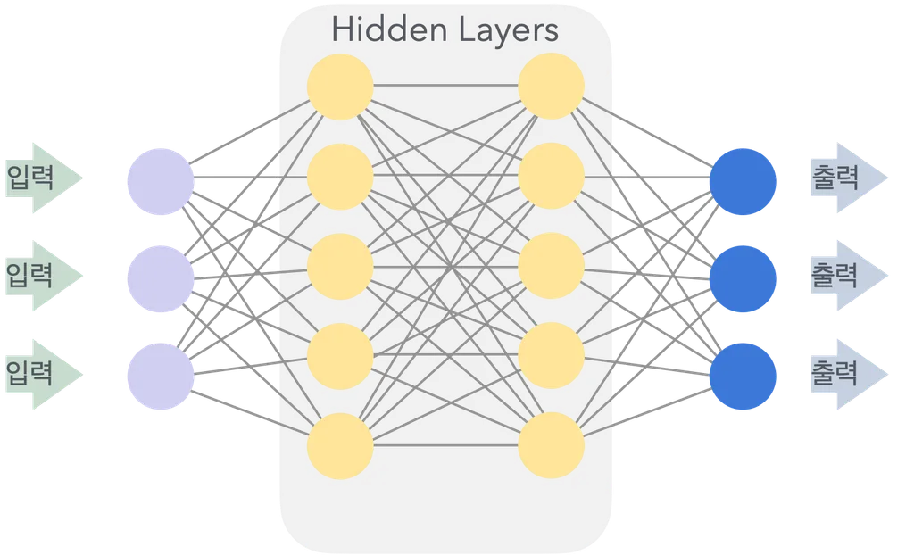

### ☑️ 딥러닝의 특징

- **비선형 추론**: 비선형 추론을 통해 복잡한 데이터의 패턴을 학습할 수 있습니다.
- **다층 구조**: 여러 층의 신경망을 사용하여 데이터의 고차원 특징을 학습합니다.
- **자동 특징 추출**: 데이터로부터 중요한 특징을 자동으로 추출하여 별도의 특징 공학(feature engineering) 과정이 필요 없습니다.

### ☑️ **인공지능, 머신러닝, 딥러닝의 관계**

- **인공지능(AI)** : 인공지능은 인간의 지능을 모방하여 문제를 해결하는 기술을 의미합니다. AI는 규칙 기반 시스템부터 자율 학습 시스템까지 다양한 접근 방식을 포함합니다.
- **머신러닝(ML) :** 머신러닝은 데이터를 이용해 모델을 학습하고, 이를 통해 예측이나 결정을 내리는 기술입니다. 머신러닝은 AI의 하위 분야로, 지도 학습, 비지도 학습, 강화 학습 등의 방법을 포함합니다.
- **딥러닝(DL) :** 딥러닝은 머신러닝의 하위 분야로, 다층 신경망을 사용하여 데이터를 학습합니다. 딥러닝은 특히 대규모 데이터와 복잡한 문제를 다루는 데 강력한 성능을 발휘합니다.
---

## 신경망의 기본 원리

### 01. 퍼셉트론과 다층 퍼셉트론(XOR 문제 포함)

### ☑️ 단일 퍼셉트론의 개념

- 퍼셉트론(Perceptron)은 인공 신경망의 가장 기본적인 단위로, 하나의 뉴런을 모델링한 것입니다.
    - 입력 값을 받아 
    - 가중치(weight)를 곱하고
    - 이를 모두 더한 후 
    - 활성화 함수(activation function)를 통해 
    - 출력 값을 결정합니다.
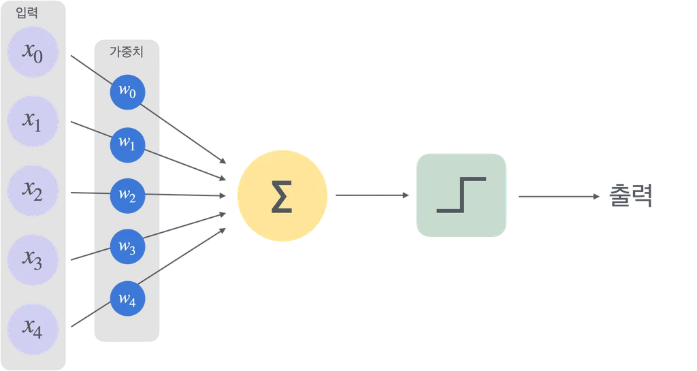
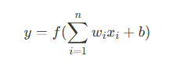
- 입력 (x₁, x₂, …, xₙ) : 
퍼셉트론은 여러 개의 입력 값을 받습니다. 예를 들어, 이미지의 픽셀 값이나 어떤 특징(특징)을 숫자로 표현한 값들이 될 수 있습니다.

- 가중치 (w₁, w₂, …, wₙ) : 
각 입력 값에는 그 중요도를 나타내는 가중치가 곱해집니다. 만약 어떤 입력이 결과에 더 큰 영향을 준다면, 그 입력에 해당하는 가중치가 더 크게 설정됩니다.

- 바이어스 (b) : 
바이어스는 결과를 조정하기 위한 상수 값입니다. 모든 입력에 동일하게 더해지며, 퍼셉트론의 출력을 조정하는 역할을 합니다.

- 합산 (Σ) : 
각 입력 값에 가중치를 곱한 후, 모두 합칩니다. 이때 바이어스도 더해집니다. 즉,
w₁x₁ + w₂x₂ + … + wₙxₙ + b
이 합이 퍼셉트론 내부에서 계산되는 총 입력 값입니다.

- 활성화 함수 (f) : 
마지막으로 이 합산된 값을 활성화 함수 f에 넣습니다. 이 함수는 결과를 한정된 범위(예: 0과 1 사이 또는 -1과 1 사이)로 변환해 주며, 최종 출력 y를 만듭니다. 활성화 함수는 퍼셉트론이 "결정"을 내리게 하는 중요한 부분입니다.

### ☑️ **다층 퍼셉트론(MLP)의 개념**

- 다층 퍼셉트론(Multi-Layer Perceptron, MLP)은 여러 층의 퍼셉트론을 쌓아 올린 신경망 구조입니다.
- MLP
  - 입력층(input layer), 은닉층(hidden layer), 출력층(output layer)으로 구성
  - 각 층의 뉴런들이 서로 연결되어 있습니다.
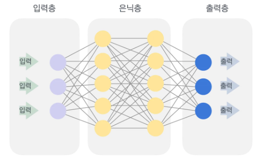

### ☑️ **입력, 은닉, 출력 레이어의 개념**

- **입력 레이어(Input Layer) :** 
  - 외부 데이터가 신경망에 입력되는 부분
  - 입력 레이어의 뉴런 수는 입력 데이터의 특징 수와 동일합니다.
- **은닉 레이어(Hidden Layer) :** 
  - 입력 레이어와 출력 레이어 사이에 위치한 층
  - 입력 데이터를 처리하고 특징을 추출하는 역할
  - 은닉 레이어의 뉴런 수와 층 수는 모델의 복잡성과 성능에 영향을 미칩니다.
- **출력 레이어(Output Layer) :** 
  - 출력 레이어는 신경망의 마지막 층으로, 최종 예측 값을 출력
  - 출력 레이어의 뉴런 수는 예측하려는 클래스 수 또는 회귀 문제의 출력 차원과 동일합니다.

### ☑️ **XOR 문제와 MLP**

- 단일 퍼셉트론은 선형 분류기이기 때문에 XOR 문제와 같은 비선형 문제를 해결할 수 없습니다.
- XOR 문제는 두 입력 값이 다를 때만 1을 출력하는 문제로, 단일 퍼셉트론으로는 해결할 수 없습니다.
- 그러나 MLP는 은닉층을 통해 비선형성을 학습할 수 있어 XOR 문제를 해결할 수 있습니다.
---

## 활성화 함수

### 활성화 함수의 필요성과 종류

### ☑️ 활성화 함수의 필요성

- 활성화 함수는 신경망의 각 뉴런에서 입력값을 출력값으로 변환하는 역할을 합니다.
- 활성화 함수가 없다면 신경망은 단순 선형변환만 수행하게 되어 복잡한 패턴을 학습할 수 없습니다.
- 활성화 함수는 비 선형성을 도입하여 신경망이 복잡한 패턴을 학습할 수 있게합니다.

### ☑️ 활성화 함수의 종류

**ReLU** **(Rectified Linear Unit)**
- 네트워크에 비선형성을 추가

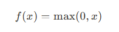
- 입력 x가 0보다 크면 그대로 x를 출력하고, 0 이하이면 0을 출력 
- 장점: 계산이 간단하고, 기울기 소실 문제(vanishing gradient problem)를 완화합니다.
- 단점: 음수 입력에 대해 기울기가 0이 되는 '죽은 ReLU' 문제가 발생할 수 있습니다.

**Sigmoid**
- 입력값을 0과 1 사이로 압축하여 확률적인 해석이 가능하게 하여 각 뉴런의 출력값을 정규화하는 역할

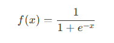
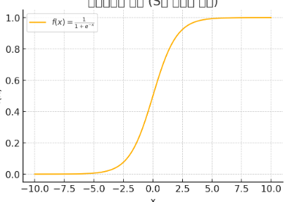
- x가 매우 작으면 (음의 큰 값) 출력은 0에 가깝고, x가 매우 크면 (양의 큰 값) 출력은 1에 가깝습니다.
- 장점: 출력 값이 0과 1 사이로 제한되어 확률을 표현하기에 적합합니다.
- 단점: 기울기 소실 문제와 출력 값이 0 또는 1에 가까워질 때 학습이 느려지는 문제가 있습니다.

**Tanh (Hyperbolic Tangent)**

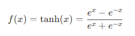
- x가 매우 큰 양수일 경우 출력은 1에 가까워지고, 매우 큰 음수일 경우 출력은 -1에 가까워집니다.
- 장점: 출력 값이 -1과 1 사이로 제한되어 중심이 0에 가까워집니다.
- 단점: 기울기 소실 문제가 발생할 수 있습니다.

---

## 손실 함수와 최적화 알고리즘

### 손실함수의 역할
- 손실 함수(Loss Function)는 모델의 예측 값과 실제 값 사이의 차이를 측정하는 함수입니다.
- 손실 함수는 모델의 성능을 평가하고, 최적화 알고리즘을 통해 모델을 학습시키는 데 사용됩니다.

### ☑️ 주요 손실 함수의 종류

**MSE (Mean Squared Error)**
- 모델의 예측값과 실제 값 사이의 차이를 제곱한 후
- 전체 데이터 개수로 평균을 내어 오차의 크기를 측정

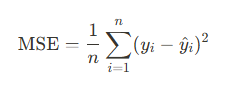

- 사용 분야: 회귀 문제에서 주로 사용됩니다.
- 특징: 예측 값과 실제 값의 차이를 제곱하여 평균을 구합니다.

**Cross-Entropy**
- 실제 분포와 예측 분포 사이의 차이를 수치화하여, 모델이 잘못 예측했을 때 큰 패널티를 부여

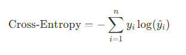

- 사용 분야: 분류 문제에서 주로 사용됩니다.
- 특징: 예측 확률과 실제 클래스 간의 차이를 측정합니다.
---

## 최적화 알고리즘의 개념과 종류

### ☑️ **최적화 알고리즘의 개념**

- 손실 함수를 최소화하기 위해 모델의 가중치를 조정하는 방법입니다.
- 손실 함수의 기울기를 계산하고, 이를 바탕으로 가중치를 업데이트합니다.

### ☑️ **주요 최적화 알고리즘의 종류**

- **SGD (Stochastic Gradient Descent)**(빠르게 조금씩 배우기)
    - 개념: 무작위로 선택된 일부 데이터(미니배치)를 사용하여 기울기를 계산하고 가중치를 업데이트합니다.
    - 장점: 계산이 빠르고, 큰 데이터셋에서도 효율적으로 동작합니다.
    - 단점: 최적점에 도달하기까지 진동이 발생할 수 있습니다.
- **Adam (Adaptive Moment Estimation)**(빠르게 똑똑하게 배우기)
    - 개념
      - SGD와 비슷하지만, 매번 얼마나 빠르게 배울지(학습률)를 스스로 조절합니다. 
      - 이전에 배운 정보(모멘텀)와 오류 크기를 함께 고려
    - 장점: 빠른 수렴 속도와 안정적인 학습을 제공합니다.
    - 단점: 하이퍼파라미터 설정이 복잡할 수 있습니다.

---

## 역전파

### ☑️ **역전파 알고리즘의 개념**

- 신경망의 가중치를 학습시키기 위해 사용되는 알고리즘입니다.
- 출력에서 입력 방향으로 손실 함수의 기울기를 계산하고, 이를 바탕으로 가중치를 업데이트합니다.

### ☑️ **역전파의 수학적 원리**

- 연쇄 법칙(Chain Rule)을 사용해 손실함수의 기울기를 계산합니다.
- 각 층의 기울기는 이전 층의 기울기와 현재 층의 기울기를 곱하여 계산합니다.
- 이를 통해 신경망의 모든 가중치가 업데이트 됩니다
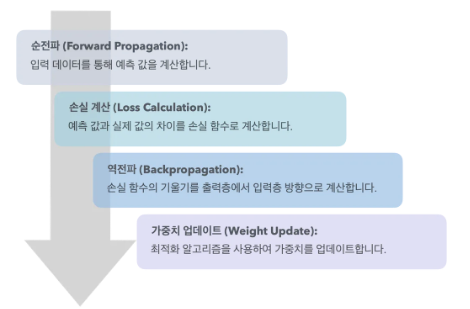
