# Machine Learning

## 머신러닝에서 중요한 요소
- 입력과 예측해야 하는 값
- AI 모델 
- 평가지표

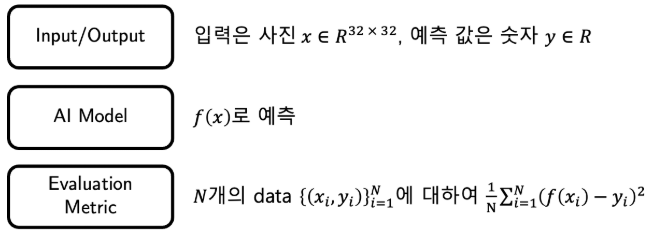
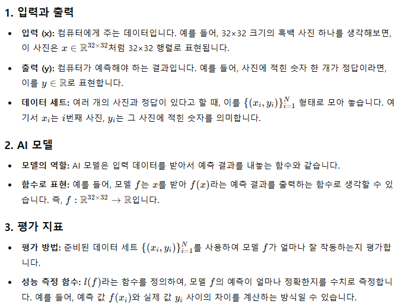

### Linear regression
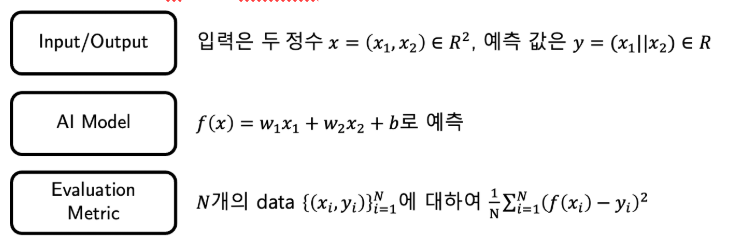
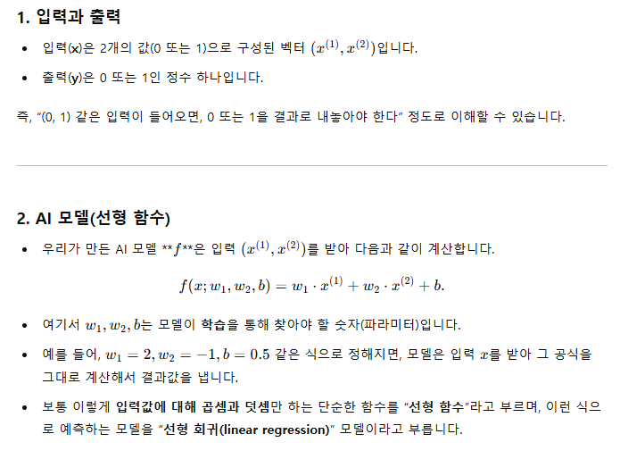
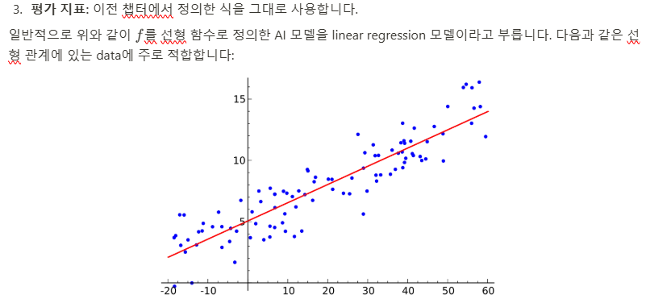
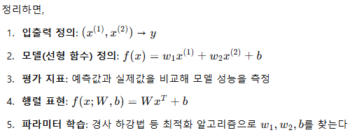

### Gradient Descent
손실(오차)을 줄이기 위해 파라미터 W를 조금씩 조정하는 방법
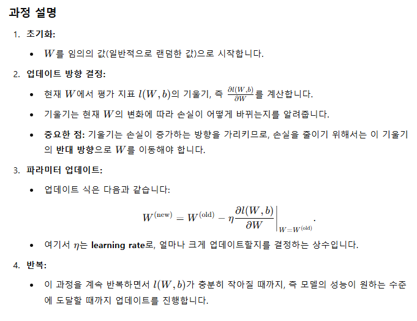
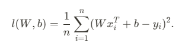
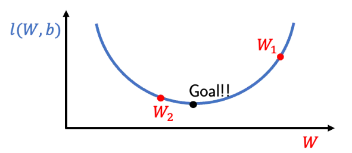
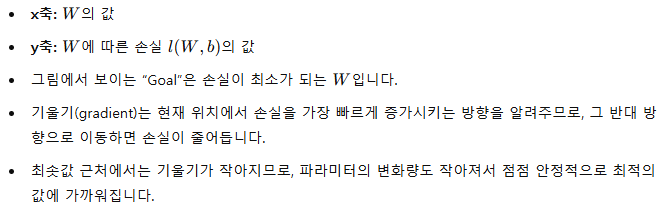
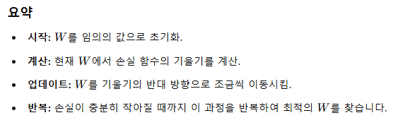

### Linear regression 실습
1. library import
```python
import torch
import numpy as np
```

2. OR Problem
```python
x = torch.tensor([
    [0., 0.],
    [0., 1.],
    [1., 0.],
    [1., 1.]
])
y = torch.tensor([0, 1, 1, 1])

print(x.shape, y.shape)
// torch.Size([4, 2]) torch.Size([4])
```

3. Linear regression W, b 정의
```python
w = torch.randn((1, 2)) // 정규분포(평균0, 분산1)인 1행 2열 생성
b = torch.randn((1, 1)) // 정규분포 1행 1열 생성

print(w.shape, b.shape)
//torch.Size([1, 2]) torch.Size([1, 1])
```

4. 평가함수, 손실함수
- 평가함수
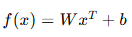
- 손실함수
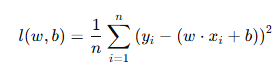
```python
def pred(w, b, x):
  return torch.matmul(w, x.T) + b

def loss(w, b, x, y):
  return (y - pred(w, b, x)).pow(2).mean()
```

5. W,b에 대한 기울기
```python
def grad_w(w, b, x, y):
  # w: (1, d), b: (1, 1), x: (n, d), y: (n)
  tmp1 = torch.matmul(w, x.T)  # wxT 각 데이터에 대한 선형 결합을 계산합니다. 결과는 (1, n) 모양
  tmp2 = tmp1 + b              # WxT + b 예측값에 b를 더합니다 (1,n)의 예측결과 완성
  tmp3 = 2 * (tmp2 - y[None])  # 예측값과 실제값의 차이를 계산 (1,n)
  grad_item = tmp3.T * x       # (1,n) * (n,d) = (n, d)
  return grad_item.mean(dim=0, keepdim=True)  # (1, d)
```
tmp2

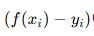

grad_item

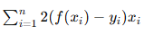

grad_item.mean(dim=0, keepdim=True)
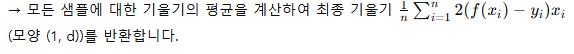

```python
def grad_b(w, b, x, y):
  # w: (1, d), b: (1, 1), x: (n, d), y: (n)
  grad_item = 2 * (torch.matmul(w, x.T) + b - y[None])  # (1, n)
  return grad_item.mean(dim=-1, keepdim=True)           # (1, 1)
```
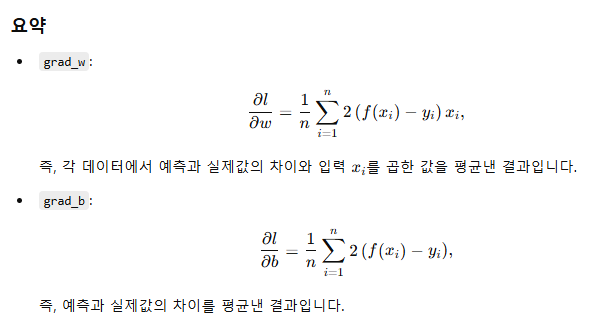

6. learning rate가 주어졌을 때 w,b 를 update하는 코드
```python
def update(x, y, w, b, lr):
  w = w - lr * grad_w(w, b, x, y)
  b = b - lr * grad_b(w, b, x, y)
  return w, b
```
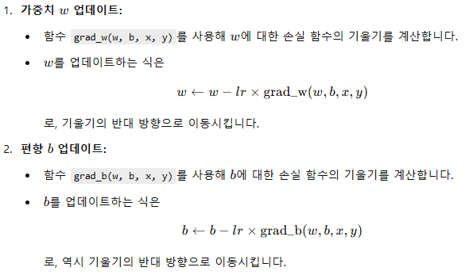

7. 학습코드
```python
def train(n_epochs, lr, w, b, x, y):
  for e in range(n_epochs):
    w, b = update(x, y, w, b, lr)
    print(f"Epoch {e:3d} | Loss: {loss(w, b, x, y)}")
  return w, b
```

8. 학습실행코드
```python
n_epochs = 100
lr = 0.1

w, b = train(n_epochs, lr, w, b, x, y)
print(w, b)
```

9. OR data에 대한  w,b 의 예측 결과와 label을 비교
```python
print(pred(w, b, x))
print(y)
// tensor([[0.2444, 0.7472, 0.7512, 1.2540]])
// tensor([0, 1, 1, 1])
```