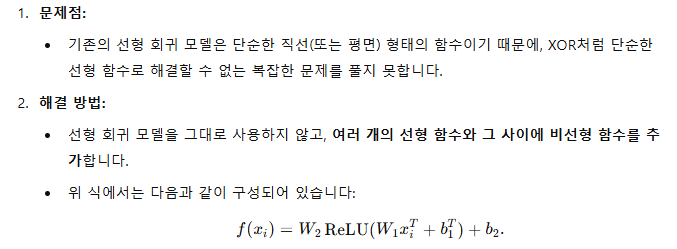
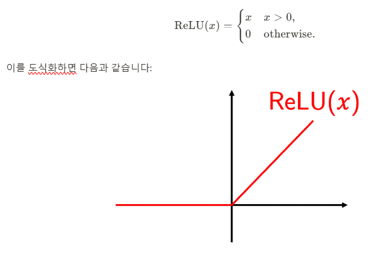
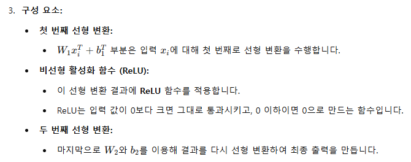
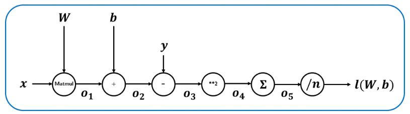
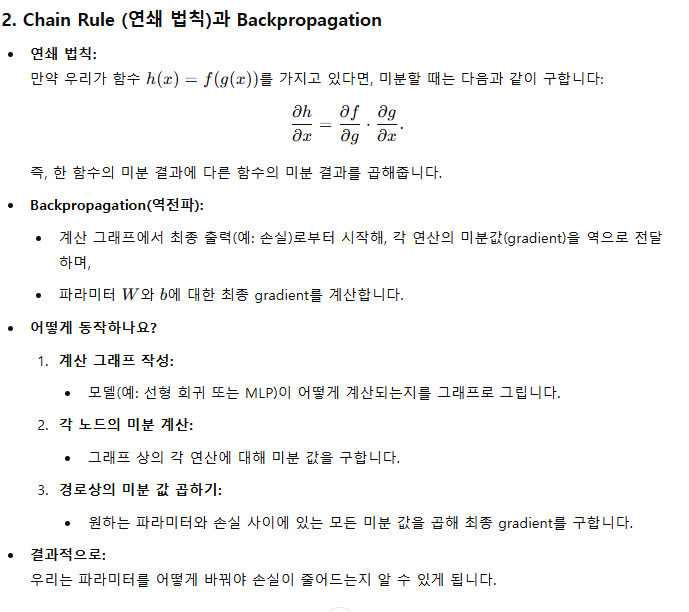

# Multi-layer Perceptron (MLP)



### 장점
- 비선형 data 처리 가능
  - 중간에 비선형 함수인 ReLU를 추가함으로써 비선형 data를 처리할 수 있게 됩니다
- 복잡한 형태의 data 처리 가능
  - linear regression 모델 하나가 아니라 여러 개를 쌓음으로써 훨씬 복잡한 형태의 data도 처리할 수 있는 expressivity(표현력)을 가집니다.

## 깊은 MLP 학습하기
- MLP를 깊게 쌓을 수록 parameter 증가
- gradient 식을 다시 계산해야함
- 깊으면 깊을 수록 parameter 수도 늘어나고 식 자체가 길어지기 때문에 계산이 힘들어짐
- backpropagation: MLP를 깊게 쌓아도 gradient를 쉽게 계산할 수 있는 방법

### Computation graph
- 연산들을 노드(원)로, 데이터의 흐름을 화살표로 표시한 그림

linear regression의 평가 함수


### Backpropagation


### Stochastic Gradient Descent(SGD)
- Data가 클때  gradient descent를 진행하기 위한 방법
- 방법
  - Data 분리하기: 먼저 주어진 data를 여러 개의 batch로 나눕니다.
  - 모델 학습하기: batch를 랜덤하게 골라, gradient descent를 한 번 진행합니다. 이를 모든 batch에 대해서 진행해줍니다.
  - 반복하기: batch를 모두 사용했다면 1) ~ 2)의 과정을 반복합니다.

### MNIST 실습
1. Library
```python
import torch
import torchvision
import torchvision.transforms as transforms
```

2. dataset
```java
// 이미지를 PyTorch에서 학습할수있는 Tensor형태로 변환
transform = transforms.ToTensor() 

trainset = torchvision.datasets.MNIST(
    root='./data',
    train=True,
    download=True,
    transform=transform //이미지를 텐서로 변환
)
```

3. 전체 data의 개수와 첫 번째 data를 출력
```python
from matplotlib import pyplot as plt

print(len(trainset))
print(trainset[0][0].shape, trainset[0][1])
plt.imshow(trainset[0][0][0], cmap='gray')
# 60000
# torch.Size([1, 28, 28]) 5
# <matplotlib.image.AxesImage at 0x7e019b9288b0>
```

4. SGD를 위한 배치 나누기
```python
batch_size = 64

trainloader = torch.utils.data.DataLoader(
    trainset,
    batch_size=batch_size,
    shuffle=True
)
```

5. 첫번째 배치 출력
```python
dataiter = iter(trainloader)
images, labels = next(dataiter)
print(images.shape, labels.shape)
# torch.Size([64, 1, 28, 28]) torch.Size([64])
```

6. (n, 1, 28, 28) shape의 image를 입력받아 0~9 사이의 정수 하나를 출력하는 3-layer MLP를 구현
```python
# PyTorch의 신경망 관련 모듈을 임포트
from torch import nn

class Model(nn.Module):
  def __init__(self, input_dim, n_dim):
    super().__init__()

    # 입력 차원(input_dim)을 받아 은닉층의 차원(n_dim)으로 매핑하는 선형 계층
    self.layer1 = nn.Linear(input_dim, n_dim)
    # 은닉층 내부에서 같은 차원(n_dim)을 유지하며 추가적인 선형 변환을 수행
    self.layer2 = nn.Linear(n_dim, n_dim)
    # 마지막 선형 계층으로, 은닉층의 차원(n_dim)에서 1차원 출력으로 변환
    self.layer3 = nn.Linear(n_dim, 1)
    # ReLU(활성화 함수)를 정의하여, 각 선형 계층의 출력에 비선형성을 부여
    self.act = nn.ReLU()

  def forward(self, x):
    # 입력 데이터 x를 배치 차원을 제외한 나머지 차원을 1차원으로 평탄화합니다. (예: 28×28 이미지가 784 길이의 벡터로 변환)
    x = torch.flatten(x, start_dim=1)
    # layer1 → ReLU: 첫 번째 선형 변환 후 활성화 함수를 적용
    x = self.act(self.layer1(x))
    # layer2 → ReLU: 첫 번째 선형 변환 후 활성화 함수를 적용
    x = self.act(self.layer2(x))
    # layer3 → ReLU: 첫 번째 선형 변환 후 활성화 함수를 적용
    x = self.act(self.layer3(x))

    return x


model = Model(28 * 28 * 1, 1024)
```

7. gradient descent를 수행해줄 optimizer를 구현
```python
from torch.optim import SGD

lr = 0.001
model = model.to('cuda')

optimizer = SGD(model.parameters(), lr=lr)
```

8. model을 MNIST에 학습하는 코드
```python
n_epochs = 100

for epoch in range(n_epochs):
  total_loss = 0.
  for data in trainloader:
    model.zero_grad() # 이전 배치에서 계산된 gradient를 초기화
    inputs, labels = data
    inputs, labels = inputs.to('cuda'), labels.to('cuda')

    preds = model(inputs) # 예측값 획득
    # 예측 값의 첫 번째 요소(preds[:, 0])와 
    # 실제 정답(labels) 사이의 차이를 제곱하고, 평균을 내어 
    # 손실(MSE, 평균 제곱 오차)을 계산
    loss = (preds[:, 0] - labels).pow(2).mean()
    loss.backward() # 역전파
    optimizer.step() # 역전파를 통한 파라미터 업데이트

    total_loss += loss.item()

  print(f"Epoch {epoch:3d} | Loss: {total_loss}")
```