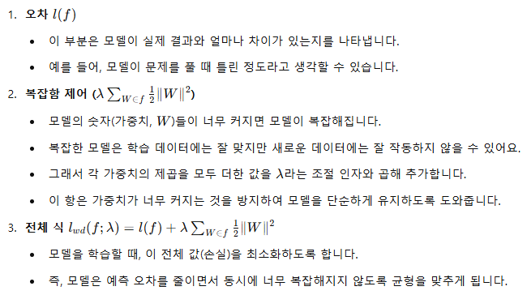

# Deep Learning Techniques

## Overfitting

### Generalization error
- Train data와 너무 다른 test data
- Train data를 외워버린 모델

### Validation data & early stopping
overfitting을 평가 지표로 파악하기 위해 사용하는 방법

- early stopping
  - validation loss를 통해 우리는 overfitting이 일어나는 지점을 알 수 있고
  - 학습을 일찍 멈추거나 test data에서 가장 좋을 것 같은 딥러닝 모델을 고를 수 있게 됩니다.

## Deep Learning Techniques

### Weight Decay(가중치 감쇠)
완만한 곡선을 만드는 모델이 generalization을 더 잘할 것

### Dropout
하나의 MLP에서 특정 연산들을 랜덤하게 지우는 방식

SGD 적용 후

이러한 node 지우기는 batch가 바뀔 때 마다 새롭게 시행됩니다. 학습할 때는 매 batch마다 랜덤하게 node를 지우면서 학습을 진행

### Adam Optimizer

- 전통적인 방법인 gradient descent는 오류(손실)가 부드러운 곡선 모양일 때는 잘 작동
- 실제로는 오류의 모습이 매우 복잡해서 이 방법만으로는 최적의 답을 찾기 어려울 때가 많음
- 두 가지 핵심 아이디어
  - 관성 : Adam은 이전에 가던 방향을 기억해 현재 업데이트할 때 조금 더 그 방향으로 이동
  - 학습률 조절 : 오류가 아주 작게 변하는 상황에서는 학습률을 높여서 빠르게 빠져나오고, 오류가 크게 변할 때는 학습률을 낮춰서 섬세하게 조정
    - 극솟점 근처일 때 learning rate 높이기(Local Minimum 탈출)
    - 극솟점에서 멀 때 learning rate 낮추기(minimum 찾기)

