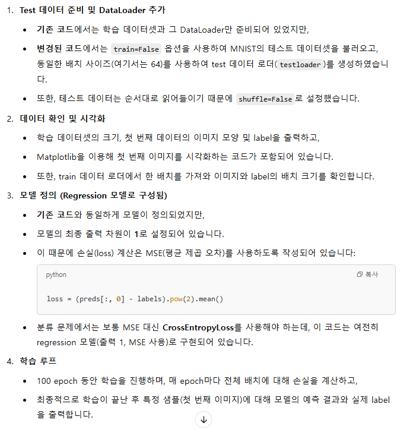
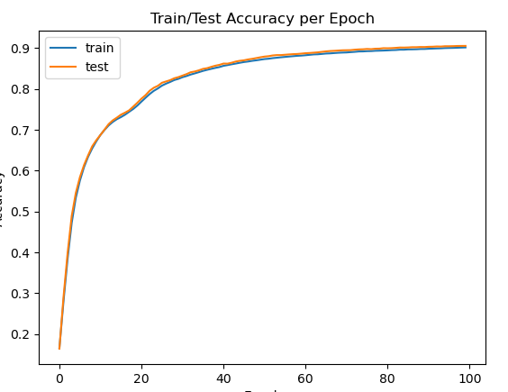

```python
import os
os.environ['KMP_DUPLICATE_LIB_OK'] = 'True'
```

```python
import torch # torch, torchvision: 딥러닝 모델과 데이터를 다루기 위해 PyTorch 및 관련 라이브러리를 불러옵니다.
import torchvision
import torchvision.transforms as transforms # transforms: 이미지 데이터를 텐서로 변환하기 위한 도구
from torch import nn # nn: 신경망 레이어, 모델 등 다양한 모듈을 제공
from torch.optim import SGD # SGD: 확률적 경사하강법(optimizer)
import numpy as np # numpy & matplotlib: 데이터 조작과 시각화를 위해 사용
from matplotlib import pyplot as plt
```

```python
# 2. Train 데이터셋 준비 (MNIST 학습 데이터, train=True)
trainset = torchvision.datasets.MNIST(
  root='./data',        # 데이터를 저장할 경로
  train=True,           # 학습 데이터 사용
  download=True,        # 데이터가 없으면 다운로드
  transform=transform   # 이미지 변환 방식 적용
)
```

```python
# 3. Train 데이터 로더 생성 (batch size=256, 무작위 섞기)
# DataLoader: 학습 데이터를 지정된 배치 크기로 나누어 모델 학습에 공급
batch_size = 256  # 변경: 배치 사이즈 256 사용
trainloader = torch.utils.data.DataLoader(
  trainset,
  batch_size=batch_size,
  shuffle=True         # 학습 시에는 데이터를 무작위로 섞습니다.
)
```

```python
# 4. Test 데이터셋 준비 (MNIST 테스트 데이터, train=False)
# testset: MNIST의 테스트 데이터를 사용합니다. train=False로 설정하여 학습 데이터와 구분
testset = torchvision.datasets.MNIST(
  root='./data',        # 데이터를 저장할 경로
  train=False,          # 테스트 데이터 사용 (train=False)
  download=True,        # 데이터가 없으면 다운로드
  transform=transform   # 이미지 변환 방식 적용
)
```

```python
# 5. Test 데이터 로더 생성 (batch size=256, 순서대로 로드)
testloader = torch.utils.data.DataLoader(
  testset,
  batch_size=batch_size,
  shuffle=False         # 테스트 데이터는 순서를 섞지 않습니다.
)
```

```python
# 7. 모델 정의 (분류 문제에 맞게 최종 output dimension을 10으로 수정)
class Model(nn.Module):
  def __init__(self, input_dim, n_dim):
    super().__init__()
    # 첫 번째 은닉층: 입력 차원 -> n_dim
    self.layer1 = nn.Linear(input_dim, n_dim)
    # 두 번째 은닉층: n_dim -> n_dim
    self.layer2 = nn.Linear(n_dim, n_dim)
    # 출력층: n_dim -> 10 (0~9 총 10개 클래스)
    self.layer3 = nn.Linear(n_dim, 10)
    self.act = nn.ReLU()  # ReLU 활성화 함수

  def forward(self, x):
    # 이미지를 1차원 벡터로 변환 (batch_size x (28*28))
    x = torch.flatten(x, start_dim=1)
    x = self.act(self.layer1(x))  # 첫 번째 은닉층 + 활성화
    x = self.act(self.layer2(x))  # 두 번째 은닉층 + 활성화
    x = self.layer3(x)            # 출력층 (활성화 함수 미적용; CrossEntropyLoss 내부에서 softmax 처리)
    return x
```

```python
# 8. 모델 생성 및 GPU로 이동, 입력 차원 = 28x28, 은닉층 차원 = 1024
model = Model(28 * 28 * 1, 1024)
model = model.to('cuda')
```

```python
# 9. 옵티마이저와 손실함수 정의
lr = 0.001
optimizer = SGD(model.parameters(), lr=lr)
criterion = nn.CrossEntropyLoss()  # 분류 문제에 적합한 손실 함수 (CrossEntropyLoss) 적용
```

```python
# 10. 정확도 측정을 위한 함수 정의
def accuracy(model, dataloader):
  cnt = 0
  acc = 0
  # dataloader의 배치마다 순회하며 예측값과 실제 label 비교
  for data in dataloader:
    inputs, labels = data
    inputs, labels = inputs.to('cuda'), labels.to('cuda')
    preds = model(inputs)
    preds = torch.argmax(preds, dim=-1)  # 각 배치에서 가장 큰 logit을 가진 클래스를 선택
    cnt += labels.shape[0]
    acc += (labels == preds).sum().item() # 예측과 실제 label이 일치하는 수를 합산
  return acc / cnt
```

```python
# 11. 학습 과정에서 epoch마다 train과 test 정확도 저장을 위한 리스트 생성
n_epochs = 100
train_accs = []
test_accs = []
```

```python
# 12. 모델 학습 루프
for epoch in range(n_epochs):
  model.train()  # 학습 모드 설정
  total_loss = 0.0
  for data in trainloader:
    # optimizer의 기울기를 0으로 초기화
    optimizer.zero_grad()
    inputs, labels = data
    inputs, labels = inputs.to('cuda'), labels.to('cuda')

    preds = model(inputs)                   # 모델 예측 (logits 출력)
    loss = criterion(preds, labels)         # CrossEntropyLoss로 손실 계산
    loss.backward()                         # 역전파 수행하여 기울기 계산
    optimizer.step()                        # 파라미터 업데이트

    total_loss += loss.item()               # 배치별 손실 누적

  # 한 epoch 끝난 후, train과 test 데이터셋에 대한 정확도 측정
  model.eval()  # 평가 모드 설정 (예: dropout, batch norm 등이 적용되지 않음)
  train_acc = accuracy(model, trainloader) # 학습 데이터 정확도
  test_acc = accuracy(model, testloader)   # 테스트 데이터 정확도
  train_accs.append(train_acc)
  test_accs.append(test_acc)

  print(f"Epoch {epoch:3d} | Loss: {total_loss:.4f} | Train Acc: {train_acc:.4f} | Test Acc: {test_acc:.4f}")
```

```python
# 13. 학습 후 정확도 변화 시각화 함수 정의
def plot_acc(train_accs, test_accs, label1='train', label2='test'):
  x = np.arange(len(train_accs)) # x축에 epoch 번호를 생성
  plt.plot(x, train_accs, label=label1)
  plt.plot(x, test_accs, label=label2)
  plt.xlabel("Epoch")
  plt.ylabel("Accuracy")
  plt.title("Train/Test Accuracy per Epoch")
  plt.legend()
  plt.show()
```

```python
# 14. 저장된 학습 및 테스트 정확도 변화를 플롯하여 시각화
plot_acc(train_accs, test_accs)
```



```python
# 15. 임의의 테스트 예시: 첫 번째 이미지에 대한 모델 예측 확인
idx = 0
x = trainset[idx][0][None]  # 첫 번째 이미지를 배치 형태로 변환 (1, 1, 28, 28)
x = x.to('cuda')
model.eval() # 평가 모드 전환 (필요시 dropout 등 비활성화)
with torch.no_grad():
  output = model(x) # 모델 예측 (logit 출력)
predicted_class = torch.argmax(output, dim=-1).item() # 예측 결과에서 가장 큰 logit 인덱스 선택
true_label = trainset[idx][1] # 실제 label
print("모델 예측:", predicted_class, "| 실제 label:", true_label)
```