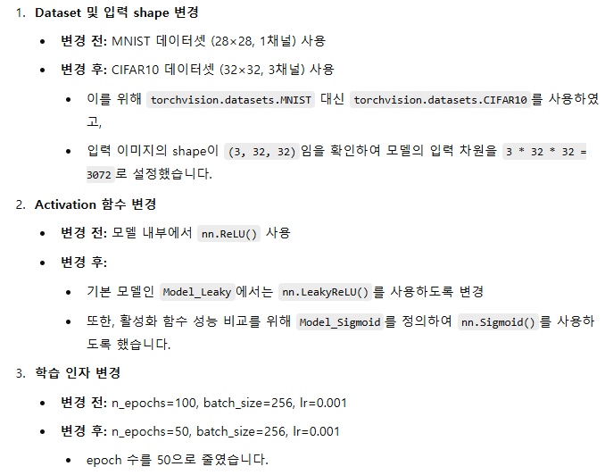
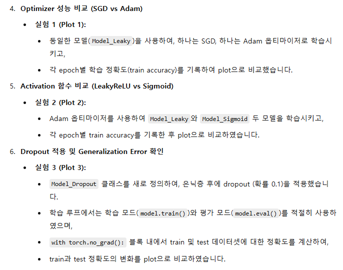
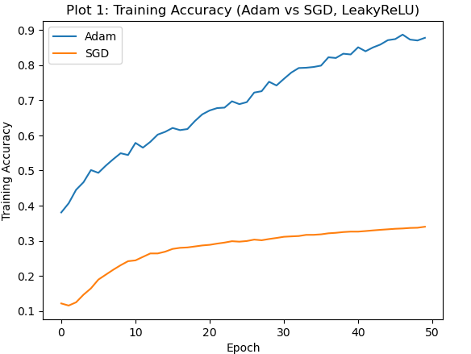
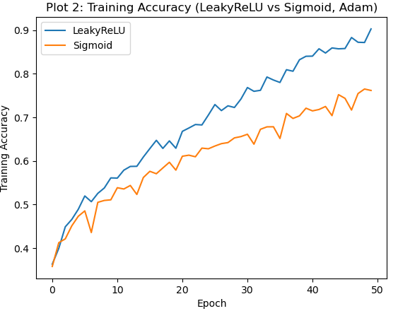
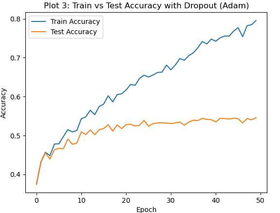

```python
import os
os.environ['KMP_DUPLICATE_LIB_OK'] = 'True'
```

```python
import torch
import torchvision
import torchvision.transforms as transforms
from torch import nn
from torch.optim import SGD, Adam
import numpy as np
import matplotlib.pyplot as plt
```

```python
#######################################
# 1. Dataset 변경: MNIST → CIFAR10
#######################################
# CIFAR10은 3채널(RGB) 이미지이고 크기가 32x32입니다.
transform = transforms.ToTensor()

# CIFAR10 학습 데이터셋 (train=True)
trainset = torchvision.datasets.CIFAR10(
    root='./data',
    train=True,
    download=True,
    transform=transform
)

# CIFAR10 테스트 데이터셋 (train=False)
testset = torchvision.datasets.CIFAR10(
    root='./data',
    train=False,
    download=True,
    transform=transform
)

# DataLoader 생성 (batch_size = 256, train은 shuffle, test는 shuffle=False)
batch_size = 256
trainloader = torch.utils.data.DataLoader(
    trainset,
    batch_size=batch_size,
    shuffle=True
)
testloader = torch.utils.data.DataLoader(
    testset,
    batch_size=batch_size,
    shuffle=False
)
```

```python
# CIFAR10 입력 shape 확인 (예상: (3, 32, 32))
sample_img, sample_label = trainset[0]
print("CIFAR10 sample image shape:", sample_img.shape)  # (3, 32, 32)
```
- ReLU: ReLU는 음수 입력에 대해 0을 반환하는 단순함수
- LeakyReLU는 음수 영역에서도 아주 작은 기울기를 유지
```python
#######################################
# 2. Model 및 Activation 함수 변경
#######################################
# (1) LeakyReLU를 사용하는 모델 (Model_Leaky)
class Model_Leaky(nn.Module):
    def __init__(self, input_dim, n_dim):
        super().__init__()
        self.layer1 = nn.Linear(input_dim, n_dim)
        self.layer2 = nn.Linear(n_dim, n_dim)
        self.layer3 = nn.Linear(n_dim, 10)  # CIFAR10은 10개 클래스
        self.act = nn.LeakyReLU()         # 기존 ReLU 대신 LeakyReLU 사용

    def forward(self, x):
        x = torch.flatten(x, start_dim=1)  # 2D 이미지를 1차원 벡터로 변환
        x = self.act(self.layer1(x))
        x = self.act(self.layer2(x))
        x = self.layer3(x)  # 출력층에서는 활성화 함수 적용하지 않음 (CrossEntropyLoss 내부 softmax)
        return x
```

- Sigmoid 활성화 함수: Sigmoid 함수는 입력 값을 0과 1 사이로 매핑
```python
# (2) Sigmoid를 사용하는 모델 (Model_Sigmoid) → 활성화 함수 비교용
class Model_Sigmoid(nn.Module):
    def __init__(self, input_dim, n_dim):
        super().__init__()
        self.layer1 = nn.Linear(input_dim, n_dim)
        self.layer2 = nn.Linear(n_dim, n_dim)
        self.layer3 = nn.Linear(n_dim, 10)
        self.act = nn.Sigmoid()  # Sigmoid 활성화 함수 사용

    def forward(self, x):
        x = torch.flatten(x, start_dim=1)
        x = self.act(self.layer1(x))
        x = self.act(self.layer2(x))
        x = self.layer3(x)
        return x
```

- Dropout: 학습 과정에서 무작위로 일부 뉴런의 출력을 0으로 만들어 과적합(overfitting)을 방지하는 기법
```python
# (3) Dropout을 적용한 모델 (Model_Dropout)
# LeakyReLU를 사용하며, 각 은닉층 이후에 dropout(p=0.1)을 적용합니다.
class Model_Dropout(nn.Module):
    def __init__(self, input_dim, n_dim, dropout_p=0.1):
        super().__init__()
        self.layer1 = nn.Linear(input_dim, n_dim)
        self.dropout1 = nn.Dropout(dropout_p)
        self.layer2 = nn.Linear(n_dim, n_dim)
        self.dropout2 = nn.Dropout(dropout_p)
        self.layer3 = nn.Linear(n_dim, 10)
        self.act = nn.LeakyReLU()

    def forward(self, x):
        x = torch.flatten(x, start_dim=1)
        x = self.act(self.layer1(x))
        x = self.dropout1(x)  # Dropout 적용
        x = self.act(self.layer2(x))
        x = self.dropout2(x)  # Dropout 적용
        x = self.layer3(x)
        return x
```

```python
# 입력 차원: CIFAR10은 (3,32,32) → 3*32*32 = 3072
input_dim = 3 * 32 * 32
n_dim = 1024  # 은닉층 크기
```

```python
#######################################
# 3. 정확도 계산 함수
#######################################
def accuracy(model, dataloader):
    cnt = 0
    correct = 0
    model.eval()  # 평가 모드
    with torch.no_grad():
        for data in dataloader:
            inputs, labels = data
            inputs, labels = inputs.to('cuda'), labels.to('cuda')
            outputs = model(inputs)
            preds = torch.argmax(outputs, dim=1)
            cnt += labels.size(0)
            correct += (preds == labels).sum().item()
    return correct / cnt
```

```python
#######################################
# 4. 학습 함수 정의
#######################################
def train_model(model, optimizer, criterion, trainloader, n_epochs):
    train_acc_history = []
    for epoch in range(n_epochs):
        total_loss = 0.0
        model.train()  # 매 epoch 시작 시 학습 모드로 전환
        for data in trainloader:
            optimizer.zero_grad()  # 이전 기울기 초기화
            inputs, labels = data
            inputs, labels = inputs.to('cuda'), labels.to('cuda')
            outputs = model(inputs)  # 모델 예측 (logits 출력)
            loss = criterion(outputs, labels)  # CrossEntropyLoss 사용
            loss.backward()  # 역전파로 기울기 계산
            optimizer.step()  # 파라미터 업데이트
            total_loss += loss.item()
        # 한 epoch 끝난 후 학습 정확도 계산
        acc = accuracy(model, trainloader)
        train_acc_history.append(acc)
        print(f"Epoch {epoch:3d} | Loss: {total_loss:.4f} | Train Acc: {acc:.4f}")
    return train_acc_history
```

- Adam: Adaptive Moment Estimation 방식으로, 각 파라미터에 대해 학습률을 개별적으로 조정
- SGD: 단순한 확률적 경사 하강법으로, 모든 파라미터에 동일한 학습률을 적용
- 실험 목적: 두 옵티마이저가 같은 모델(LeakyReLU 기반)에서 어떻게 학습되는지, 학습 정확도가 epoch별로 어떻게 변화하는지 비교
```python
#######################################
# 5. 실험 1: SGD와 Adam 옵티마이저 성능 비교 (Plot 1)
#######################################
n_epochs = 50  # 학습 epoch 수를 50으로 설정
lr = 0.001
criterion = nn.CrossEntropyLoss()

# (A) Adam 옵티마이저를 사용하는 Model_Leaky
model_adam = Model_Leaky(input_dim, n_dim).to('cuda')
optimizer_adam = Adam(model_adam.parameters(), lr=lr)
print("Training Model_Leaky with Adam optimizer...")
train_acc_adam = train_model(model_adam, optimizer_adam, criterion, trainloader, n_epochs)

# (B) SGD 옵티마이저를 사용하는 Model_Leaky
model_sgd = Model_Leaky(input_dim, n_dim).to('cuda')
optimizer_sgd = SGD(model_sgd.parameters(), lr=lr)
print("Training Model_Leaky with SGD optimizer...")
train_acc_sgd = train_model(model_sgd, optimizer_sgd, criterion, trainloader, n_epochs)

# Plot 1: SGD vs Adam 비교 (Train Accuracy)
epochs = np.arange(n_epochs)
plt.plot(epochs, train_acc_adam, label="Adam")
plt.plot(epochs, train_acc_sgd, label="SGD")
plt.xlabel("Epoch")
plt.ylabel("Training Accuracy")
plt.title("Plot 1: Training Accuracy (Adam vs SGD, LeakyReLU)")
plt.legend()
plt.show()
```


- LeakyReLU는 음수 영역에서도 작은 기울기를 유지하여 학습이 원활해지는 반면,
- Sigmoid는 출력이 0~1 사이로 제한되어 기울기 소실 문제가 발생할 수 있습니다.
- 동일한 Adam 옵티마이저를 사용하여, 두 모델의 학습 정확도가 epoch별로 어떻게 변화하는지 확인
```python
#######################################
# 6. 실험 2: LeakyReLU와 Sigmoid 활성화 함수 비교 (Adam optimizer 사용) (Plot 2)
#######################################
# (A) LeakyReLU 모델
model_leaky = Model_Leaky(input_dim, n_dim).to('cuda')
optimizer_leaky = Adam(model_leaky.parameters(), lr=lr)
print("Training Model_Leaky with Adam optimizer...")
train_acc_leaky = train_model(model_leaky, optimizer_leaky, criterion, trainloader, n_epochs)

# (B) Sigmoid 모델
model_sigmoid = Model_Sigmoid(input_dim, n_dim).to('cuda')
optimizer_sigmoid = Adam(model_sigmoid.parameters(), lr=lr)
print("Training Model_Sigmoid with Adam optimizer...")
train_acc_sigmoid = train_model(model_sigmoid, optimizer_sigmoid, criterion, trainloader, n_epochs)

# Plot 2: LeakyReLU vs Sigmoid 비교 (Train Accuracy)
plt.plot(epochs, train_acc_leaky, label="LeakyReLU")
plt.plot(epochs, train_acc_sigmoid, label="Sigmoid")
plt.xlabel("Epoch")
plt.ylabel("Training Accuracy")
plt.title("Plot 2: Training Accuracy (LeakyReLU vs Sigmoid, Adam)")
plt.legend()
plt.show()
```


- Dropout 적용
- 평가 시에는 model.eval()을 호출하여 dropout을 비활성화하고, torch.no_grad()를 사용하여 평가 시 메모리 사용과 계산을 최적화
- 학습 데이터(train accuracy)와 테스트 데이터(test accuracy)를 모두 측정하여, 모델이 얼마나 일반화(generalize)하는지 확인
- Plot 3에서는 두 정확도 곡선을 함께 플롯하여, overfitting이 발생했는지(학습 정확도와 테스트 정확도 차이) 비교
```python
#######################################
# 7. 실험 3: Dropout 적용 후 generalization error 확인 (Adam optimizer 사용) (Plot 3)
#######################################
model_dropout = Model_Dropout(input_dim, n_dim, dropout_p=0.1).to('cuda')
optimizer_dropout = Adam(model_dropout.parameters(), lr=lr)
train_acc_history = []
test_acc_history = []

for epoch in range(n_epochs):
    model_dropout.train()  # 학습 모드 (Dropout 적용)
    total_loss = 0.0
    for data in trainloader:
        optimizer_dropout.zero_grad()
        inputs, labels = data
        inputs, labels = inputs.to('cuda'), labels.to('cuda')
        outputs = model_dropout(inputs)
        loss = criterion(outputs, labels)
        loss.backward()
        optimizer_dropout.step()
        total_loss += loss.item()

    # 평가: train과 test 데이터에 대해 정확도 측정 (평가 시 model.eval() + torch.no_grad())
    with torch.no_grad():
        model_dropout.eval()
        train_acc = accuracy(model_dropout, trainloader)
        test_acc = accuracy(model_dropout, testloader)
    train_acc_history.append(train_acc)
    test_acc_history.append(test_acc)
    print(f"Epoch {epoch:3d} | Loss: {total_loss:.4f} | Train Acc: {train_acc:.4f} | Test Acc: {test_acc:.4f}")

# Plot 3: Dropout 적용 모델의 Train vs Test Accuracy
plt.plot(epochs, train_acc_history, label="Train Accuracy")
plt.plot(epochs, test_acc_history, label="Test Accuracy")
plt.xlabel("Epoch")
plt.ylabel("Accuracy")
plt.title("Plot 3: Train vs Test Accuracy with Dropout (Adam)")
plt.legend()
plt.show()
```

- 학습이 진행됨에 따라 모델의 손실이 감소하고, 학습 정확도가 증가하지만,
- 테스트 정확도가 상대적으로 낮게 유지되어 모델이 학습 데이터에는 과적합되어 있다는 신호
- 이런 차이를 줄이기 위한 추가 조정(모델 구조, 하이퍼파라미터 튜닝, 추가 정규화 기법 등)이 필요