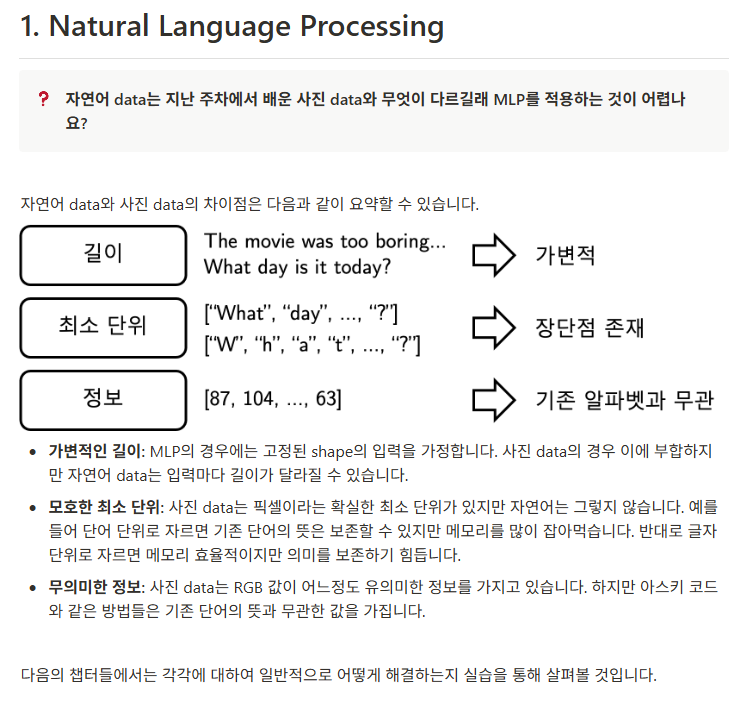
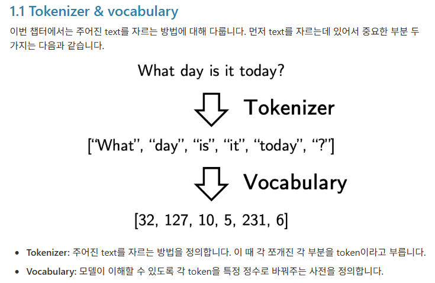
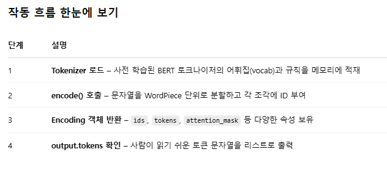
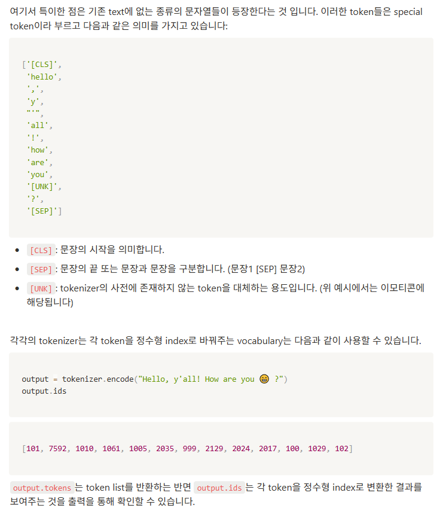
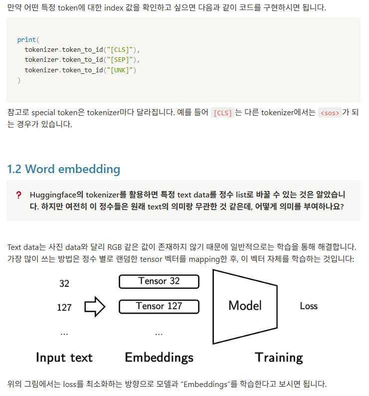
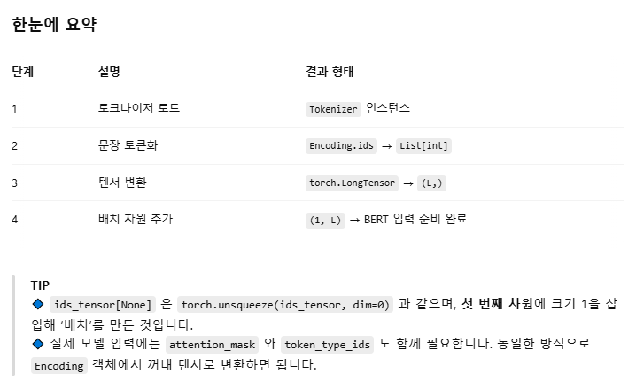
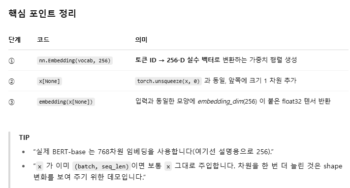
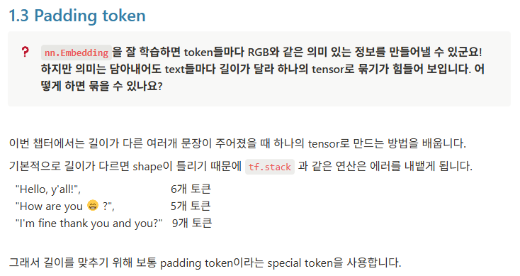
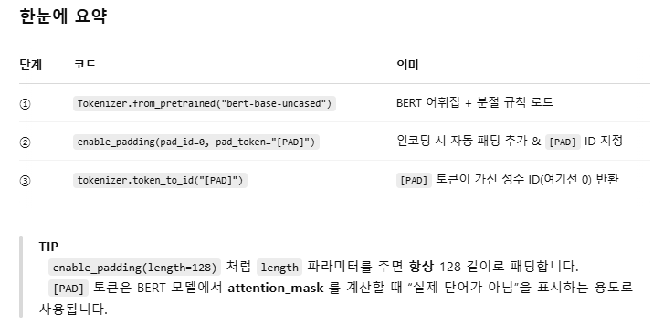
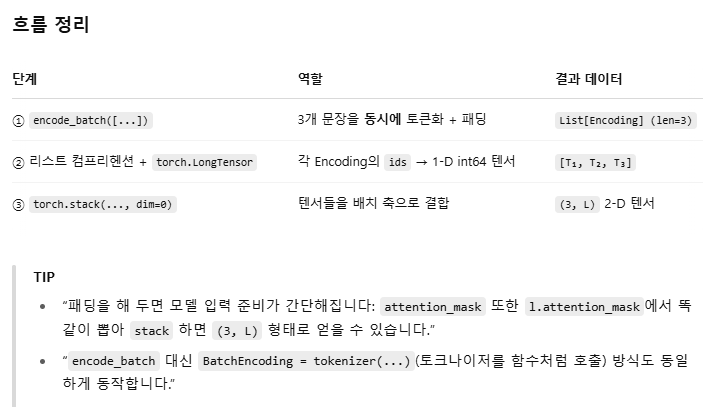

```python
# Hugging Face의 `tokenizers` 라이브러리에서 Tokenizer 클래스를 가져옵니다.
from tokenizers import Tokenizer

# ① 사전 학습(pre‑trained)된 BERT‑base‑uncased 토크나이저를 불러옵니다.
#    - ‘uncased’ 모델이므로 대소문자를 구분하지 않습니다.
#    - 내부적으로 vocab(단어 사전)과 WordPiece 규칙이 함께 로드됩니다.
tokenizer = Tokenizer.from_pretrained("bert-base-uncased")

# ② 인코딩(토큰화)할 문장을 입력합니다.
#    - encode() 는 문자열을 받아 토큰 ID와 세그먼트 정보 등을 담은 Encoding 객체를 반환합니다.
#    - 여기서는 “Hello, y'all! How are you 😁 ?” 라는 문장을 토큰화합니다.
output = tokenizer.encode("Hello, y'all! How are you 😁 ?")

# ③ 토큰화 결과의 문자열 토큰 리스트를 확인합니다.
#    - output.tokens 는 `[CLS]`·`[SEP]` 같은 특수 토큰을 **포함하지 않은** 원본 토큰 목록입니다.
#    - BERT WordPiece 규칙상, 어절이 어근/접미사 단위로 쪼개지면 `##` 로 이어집니다.
#    - 이모지 😁 는 사전에 없으므로 `[UNK]`(unknown token) 으로 치환됩니다.
print(output.tokens)
# 예시 출력:
# ['hello', ',', 'y', "'", 'all', '!', 'how', 'are', 'you', '[UNK]', '?']
```



```python
# -----------------------------------------------------------
# 1) 라이브러리 임포트
# -----------------------------------------------------------
from tokenizers import Tokenizer   # 🤗 Hugging Face ‘tokenizers’ – 순수 Rust/Python 토크나이저
import torch                       # PyTorch – 텐서 연산 및 딥러닝 프레임워크

# -----------------------------------------------------------
# 2) 사전 학습된 BERT‑base‑uncased 토크나이저 로드
#    - 어휘집(vocab.txt), WordPiece 규칙, 후처리(특수 토큰 삽입)까지 포함
#    - ‘uncased’ 모델 → 대소문자 무시
# -----------------------------------------------------------
tokenizer = Tokenizer.from_pretrained("bert-base-uncased")

# -----------------------------------------------------------
# 3) 인코딩(토큰화) 수행
#    - encode() → Encoding 객체 반환
#    - .ids  : 정수 토큰 ID 리스트 (BERT는 [CLS]=101, [SEP]=102 포함)
#    - 예)  [101, 7592, 117, 106, 112, 188, 106, 999, 1293, 1132, 1128, 100, 136, 102]
#           └───────┘  └───────────────────────────────┘   └───┘   └───┘  └─┘
#            CLS           본문 토큰(WordPiece)             UNK     '?'   SEP
# -----------------------------------------------------------
ids = tokenizer.encode("Hello, y'all! How are you 😁 ?").ids

# -----------------------------------------------------------
# 4) PyTorch LongTensor로 변환
#    - torch.LongTensor(..) : 1‑D 정수 텐서 생성 (dtype=int64)
# -----------------------------------------------------------
ids_tensor = torch.LongTensor(ids)        # shape = (L,)  ← L = 시퀀스 길이

# -----------------------------------------------------------
# 5) [None] 인덱싱으로 차원 추가
#    - ids_tensor[None] == ids_tensor.unsqueeze(0)
#    - (L,)  →  (1, L)  : 배치 차원(batch size = 1) 생성
# -----------------------------------------------------------
x = ids_tensor[None]                      # shape = (1, L)

# -----------------------------------------------------------
# 6) 결과 확인
#    - 일반적으로 BERT 모델에 바로 투입 가능한 입력 형태
# -----------------------------------------------------------
print(x)
# tensor([[ 101, 7592,  117,  106,  112,  188,  106,  999, 1293, 1132, 1128,  100,
#          136,  102]])
```

```python
from torch import nn                # PyTorch 의 신경망(neural‑network) 모듈만 불러옵니다.

# 1) 임베딩(embedding) 레이어 정의
# --------------------------------------------------------------
# - vocab_size          : 토크나이저가 가진 전체 단어 수
#                         (= 토큰 ID 의 최대값 + 1)
# - embedding_dim (=256): 각 단어를 256차원 밀집 벡터로 표현
# - 내부적으로 (vocab_size, 256) 모양의 가중치 행렬이 생성되며,
#   학습 과정에서 단어 의미를 담도록 업데이트됩니다.
embedding = nn.Embedding(tokenizer.get_vocab_size(), 256)

# 2) 토큰 ID 텐서를 임베딩 레이어에 통과
# --------------------------------------------------------------
# x         : (1, L)  형상  ― 앞에서 만든 “배치 1, 문장 길이 L” 정수 텐서
# x[None]   : (1, 1, L) 형상 ― 다시 한 번 unsqueeze(0) 로 차원 ↑
#            (굳이 필요는 없지만 예시를 위해 배치 차원을 하나 더 만든 셈입니다)
# embedding : 정수 입력을 받아 같은 shape + 마지막에 256차원을 붙여 반환
out = embedding(x[None])            # out.shape == (1, 1, L, 256)

# 3) 결과(shape) 확인
out.shape
# >> torch.Size([1, 1, 14, 256])   # 예시 길이 L=14라면
```


```python
# -----------------------------------------------------------
# 1) 라이브러리 임포트
# -----------------------------------------------------------
from tokenizers import Tokenizer      # 🤗 Hugging Face 의 순수 Python/Rust 토크나이저

# -----------------------------------------------------------
# 2) 사전 학습된 BERT‑base‑uncased 토크나이저 로드
#    - WordPiece 규칙 + vocab.txt 파일을 메모리에 읽어옵니다.
# -----------------------------------------------------------
tokenizer = Tokenizer.from_pretrained("bert-base-uncased")

# -----------------------------------------------------------
# 3) 패딩(Padding) 기능 활성화
#    - enable_padding() 을 호출하면
#      · 각 인코딩 결과 뒤에 [PAD] 토큰을 자동으로 덧붙여
#        지정한 최대 길이(length)까지 길이를 맞춤
#      · 길이를 지정하지 않으면 **현재 배치**에서 가장 긴 문장 길이를 기준으로 맞춥니다.
#
#    인자 설명
#    ─────────
#      • pad_id   : [PAD] 토큰의 정수 ID (BERT‑base vocab 기준 0)
#      • pad_token: 실제 토큰 문자열
# -----------------------------------------------------------
tokenizer.enable_padding(pad_id=0, pad_token="[PAD]")

# -----------------------------------------------------------
# 4) '[PAD]' 토큰의 ID 확인
#    - WordPiece 어휘집에서 [PAD] 가 어떤 숫자로 매핑되어 있는지 반환
#    - 위에서 pad_id=0 으로 지정했으므로 0 이 출력됩니다.
# -----------------------------------------------------------
pad_id = tokenizer.token_to_id("[PAD]")
print(pad_id)        # >>> 0
```

```python
#예를 들어 길이가 9인 token list와 5인 token list가 있을 때, 
# 5인 token list에 `[PAD]` token4개를 붙여 길이를 맞춘 다음, 
# 두 token list를 stack 합니다. 
# 이러한 기능은 huggingface tokenizer에서 다음과 같이 구현할 수 있습니다.
# -----------------------------------------------------------
# 1) 한 번에 여러 문장을 토큰화(배치 인코딩)
# -----------------------------------------------------------
lists = tokenizer.encode_batch([
    "Hello, y'all!",            # 문장 ①
    "How are you 😁 ?",         # 문장 ②
    "I'm fine thank you and you?"  # 문장 ③
])
# • encode_batch(...)  ➜  각 문장을 개별적으로 WordPiece 분절 + [CLS]/[SEP] 삽입
# • enable_padding() 이 이미 호출되었으므로
#   └→ 현재 배치에서 **가장 긴 시퀀스 길이**에 맞춰 [PAD] 토큰(0)으로 패딩
# • 결과: Encoding 객체 3개를 담은 리스트

# -----------------------------------------------------------
# 2) 토큰 ID를 PyTorch LongTensor로 변환
# -----------------------------------------------------------
tokens = torch.stack(
    [torch.LongTensor(l.ids) for l in lists],  # 각 Encoding.ids → 1‑D LongTensor
    dim=0                                      # dim=0: 앞쪽 축으로 쌓아서 배치 차원 생성
)
# • 리스트 컴프리헨션으로 [텐서①, 텐서②, 텐서③] 생성
# • torch.stack(..., dim=0)  ➜  (batch_size, seq_len) 2‑D 텐서

# -----------------------------------------------------------
# 3) 배치 텐서의 모양(Shape) 확인
# -----------------------------------------------------------
tokens.shape    # ➜ torch.Size([3, L])
#   - 3  : 배치 내 문장 수
#   - L  : 패딩 후 공통 시퀀스 길이(가장 긴 문장의 토큰 개수)
```
