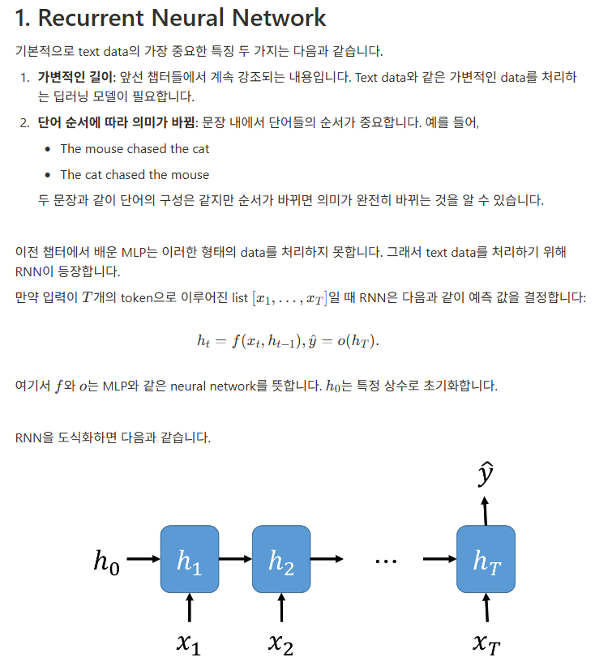
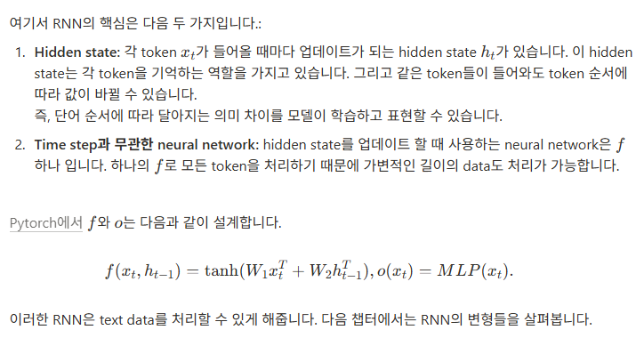
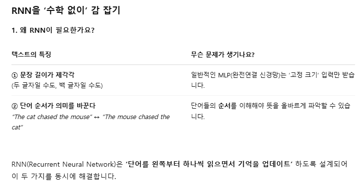
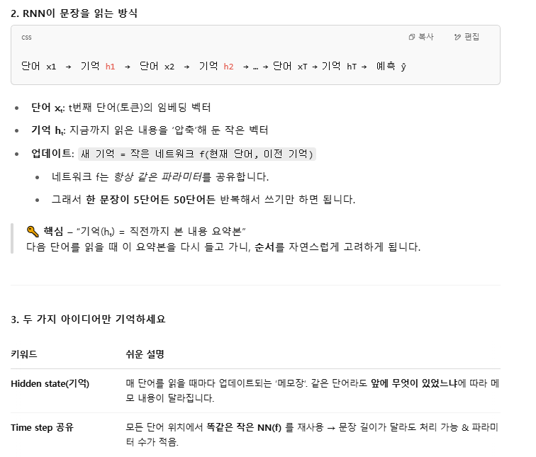
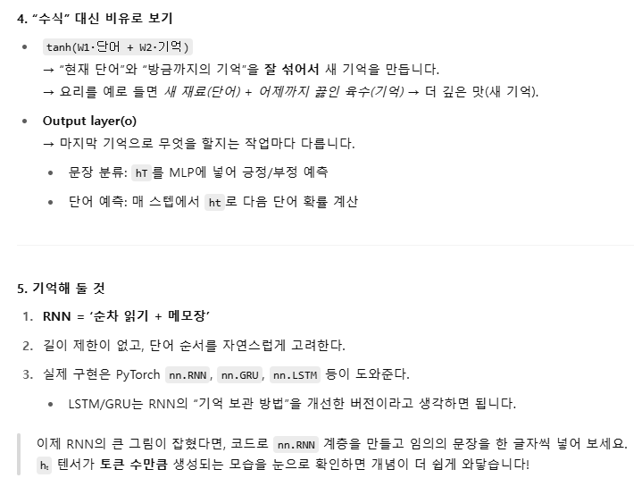
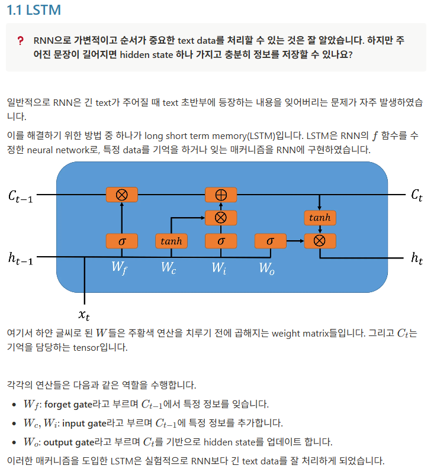
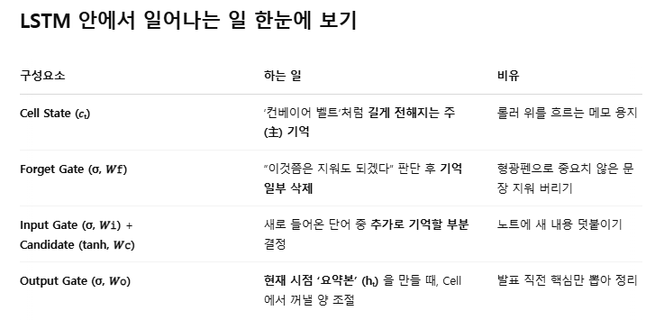
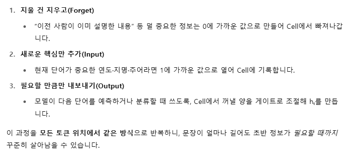


## RNN을 사용하여 주어진 영화 리뷰의 감정 분석 모델을 구현하고 학습
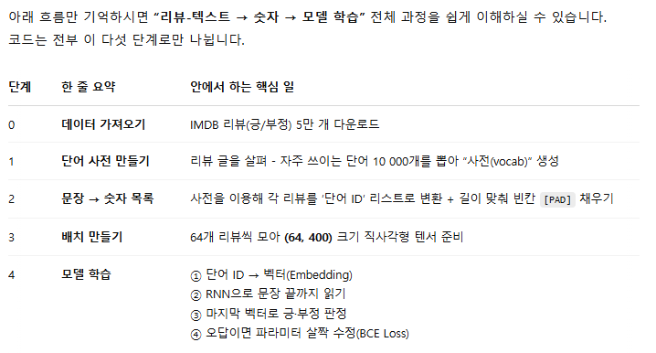
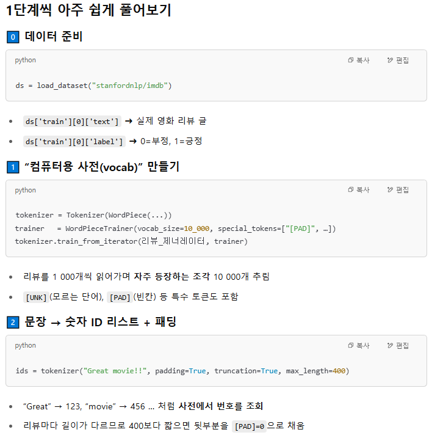
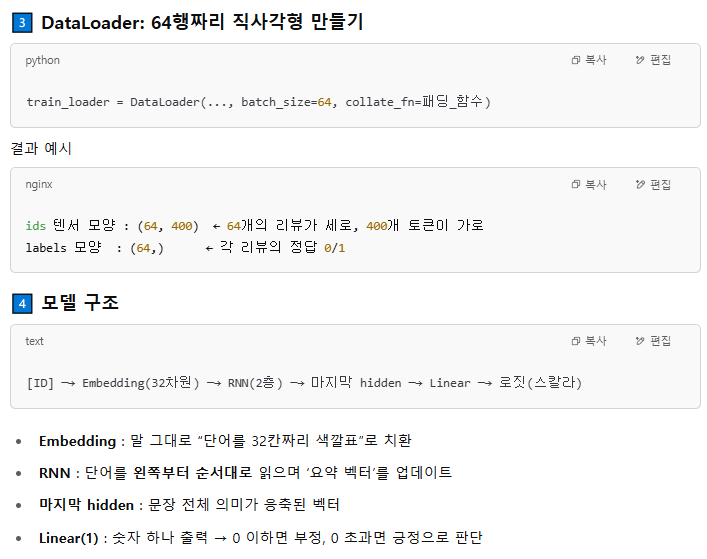
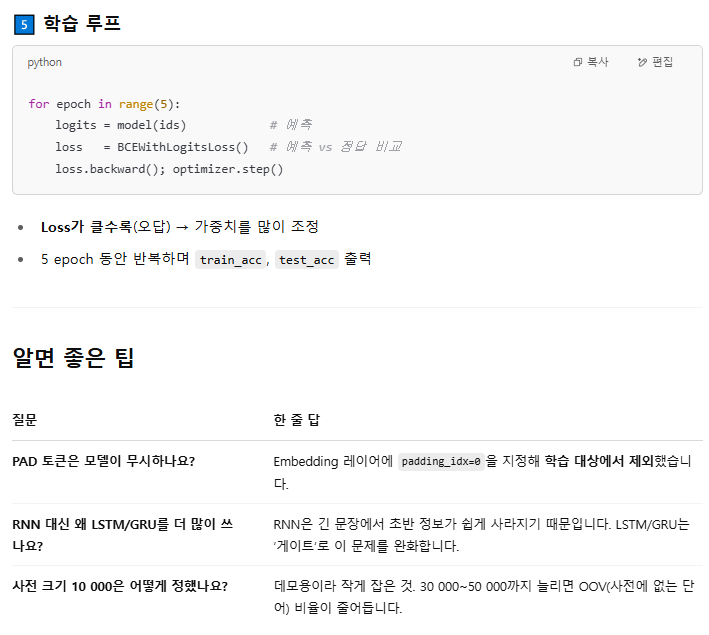
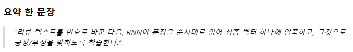
```python
######################################################################
# 0. 라이브러리 설치 & 데이터셋 로드
######################################################################
!pip install datasets                     # 🤗 Datasets: 공개 말뭉치 쉽게 로드
# Colab처럼 GPU 환경이면 이미 torch / matplotlib 설치돼 있을 것

import torch
from datasets import load_dataset

# IMDB 영화 리뷰 데이터 (훈련 25,000개, 테스트 25,000개)
ds = load_dataset("stanfordnlp/imdb")
print(ds)                                 # train / test 로 분할된 DatasetDict
print(ds['train'][0])                     # 👉 {'text': '...', 'label': 0}
```

```python
######################################################################
# 1. WordPiece 토크나이저 직접 학습
######################################################################
from tokenizers import (
    models,            # WordPiece / BPE 등 토큰화 알고리즘 선택
    normalizers,       # 정규화 규칙 (소문자화, UNICODE 처리 등)
    pre_tokenizers,    # "띄어쓰기·구두점" 단위로 1차 분할
    trainers,          # 실제 vocab 학습을 담당하는 객체
    Tokenizer,         # 토크나이저 컨테이너
)

# 1‑1) tokenizer 골격 생성 ──────────────────────────────────────────
tokenizer = Tokenizer(models.WordPiece(unk_token="[UNK]"))  # '[UNK]' : OOV 토큰
tokenizer.normalizer    = normalizers.BertNormalizer(lowercase=True)  # 대문자→소문자, HTML Strip 등
tokenizer.pre_tokenizer = pre_tokenizers.BertPreTokenizer()           # 띄어쓰기/구두점 분리

# 1‑2) 학습용 텍스트 제너레이터
#      데이터셋이 25k 문장 → 메모리에 한꺼번에 올리지 않기 위해 1,000개씩 잘라 generator로 공급
def get_training_corpus():
    for i in range(0, len(ds['train']), 1000):
        # slicing 은 사본을 만들지 않고 meta 정보만 유지하므로 메모리 효율적
        yield ds['train'][i : i + 1000]['text']   # => List[str]

# 1‑3) WordPiece Trainer 설정
special_tokens = ["[UNK]", "[PAD]", "[CLS]", "[SEP]"]      # BERT 계열 필수 토큰
trainer = trainers.WordPieceTrainer(
    vocab_size=10_000,             # 최대 사전 크기 (특수토큰 포함)
    special_tokens=special_tokens  # 위 네 개 토큰은 무조건 vocab에 포함
)

# 1‑4) 실제 학습 수행 (iterator 를 흘려보냄)
tokenizer.train_from_iterator(get_training_corpus(), trainer=trainer)

# 학습 결과 확인
print(tokenizer.encode("Hello, world!").tokens)
#   예) ['hello', ',', 'world', '!']
```

```python
######################################################################
# 2. HuggingFace Transformers 래퍼(BertTokenizerFast)로 감싸기
#    → .__call__() 만으로 padding·truncation 등을 한 번에 처리
######################################################################
from transformers import BertTokenizerFast

tokenizer = BertTokenizerFast(tokenizer_object=tokenizer)  # 내부에 방금 학습한 tokenizer 탑재
print("vocab size :", len(tokenizer))                      # 10,000 + 특수토큰 수
print("PAD id     :", tokenizer.pad_token_id)              # == 0
```

```python
######################################################################
# 3. 시퀀스 길이 통계 확인 (패딩 길이 결정에 도움)
######################################################################
from matplotlib import pyplot as plt

# 전체 train 셋을 토큰화하여 길이 수집 (시간 오래 걸릴 수 있음 → 일부 샘플링 OK)
lengths = [len(tokenizer(ex['text']).input_ids) for ex in ds['train']]
plt.hist(lengths, bins=50); plt.title("Token length (train)"); plt.show()
print("평균 길이:", sum(lengths)/len(lengths))             # 대략 230~250

# → 대부분 400 토큰 이하이므로 max_len = 400 으로 설정
```
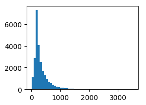

```python
######################################################################
# 4. DataLoader 준비 (문장 → 패딩된 LongTensor)
# 입력들의 list가 주어졌을 때 text들은 tokenize와 padding을 동시에 진행하여 하나의 matrix로 만드는 것은 다음과 같이 구현
######################################################################
from torch.utils.data import DataLoader

def collate_fn(batch, max_len=400):
    """
    batch : List[dict]  (각 dict는 {"text": str, "label": int})
    return: ids -> LongTensor (B, max_len)
            labels -> LongTensor (B,)
    """
    # truncation과 max_length는 길이가 max_length를 넘는 data들은 max_length에서 자르라는 옵션
    texts  = [ex['text']  for ex in batch]
    labels = [ex['label'] for ex in batch]

    # tokenizer(...) 는 dict 반환 (input_ids, attention_mask 등)
    ids = tokenizer(
        texts,
        padding=True,               # 가장 긴 문장 길이에 맞춰 PAD 삽입
        truncation=True,            # max_len 초과 시 뒷부분 자르기
        max_length=max_len
    ).input_ids                     # List[List[int]]

    return torch.LongTensor(ids), torch.LongTensor(labels)

train_loader = DataLoader(ds['train'], batch_size=64, shuffle=True,
                          collate_fn=collate_fn)
test_loader  = DataLoader(ds['test'],  batch_size=64, shuffle=False,
                          collate_fn=collate_fn)

# 첫 배치 shape 확인
x_batch, y_batch = next(iter(train_loader))
print(x_batch.shape)   # (64, 400)  ← (배치, 시퀀스 길이)
print(y_batch.shape)   # (64,)
```

```python
######################################################################
# 5. 텍스트 분류 모델 (Embedding → RNN → Linear)
# 1) Token list를 nn.Embedding으로 전처리해줍니다.
# 2) nn.RNN으로 선언된 RNN을 통과시켜 representation을 얻습니다.
# 3) 주어진 token list의 마지막 token에 해당하는 representation을 얻어 nn.Linear를 통과시켜 출력을 구합니다.
######################################################################
from torch import nn

class TextClassifier(nn.Module):
    """
    - Embedding : 단어 ID → 벡터
    - RNN       : 순방향 단순 RNN(ReLU)  (※ 실제론 LSTM/GRU가 성능↑)
    - classifier: 마지막 time‑step hidden → 로짓(긍/부정)
    """
    def __init__(self, vocab_size, hidden_dim=32, n_layers=2):
        super().__init__()

        # padding_idx=0 : [PAD] 벡터는 학습에서 제외 (gradient X)
        self.embedding  = nn.Embedding(vocab_size, hidden_dim,
                                       padding_idx=tokenizer.pad_token_id)
        # batch_first=True : 입력 shape (B, L, H)
        self.rnn        = nn.RNN(hidden_dim, hidden_dim,
                                 num_layers=n_layers,
                                 nonlinearity='relu',
                                 batch_first=True)
        self.classifier = nn.Linear(hidden_dim, 1)   # 1 로짓 → BCE Loss

    def forward(self, ids):
        """
        ids : LongTensor (B, L)
        """
        x = self.embedding(ids)      # (B, L, H)
        x, _ = self.rnn(x)           # RNN 결과 전체 time step h_t

        # 🔸 문장마다 '실제 마지막 토큰' 위치(index) 구해 그 hidden만 사용
        lengths = (ids != tokenizer.pad_token_id).sum(dim=-1) - 1  # (B,) 0‑based
        lengths = lengths.unsqueeze(-1).unsqueeze(-1)              # shape (B,1,1)
        lengths = lengths.expand(-1, 1, x.size(-1))                # (B,1,H)
        last_h  = x.gather(dim=1, index=lengths)[:, 0]             # (B, H)

        return self.classifier(last_h)     # (B, 1)   (raw logit)

model = TextClassifier(len(tokenizer)).cuda()
print(model(x_batch.cuda()).shape)         # (64, 1)
```

```python
######################################################################
# 6. 학습 준비 (손실함수 & 옵티마이저)
######################################################################
from torch.optim import Adam

loss_fn  = nn.BCEWithLogitsLoss()          # 로짓 + 시그모이드 합친 BCE
optimizer = Adam(model.parameters(), lr=1e-3)

######################################################################
# 7. 정확도 계산 헬퍼
######################################################################
def accuracy(model, loader):
    correct = total = 0
    for ids, labels in loader:
        ids, labels = ids.cuda(), labels.cuda()
        with torch.no_grad():
            logits = model(ids)
            preds  = (logits > 0).long().squeeze(-1)  # 0/1 로 변환
        total   += labels.size(0)
        correct += (preds == labels).sum().item()
    return correct / total

######################################################################
# 8. 학습 루프
######################################################################
n_epochs = 5        # 데모 용도로 5 epoch; 실제 50 epoch까지 돌려도 OK

for epoch in range(1, n_epochs + 1):
    # ─────────────────── train ───────────────────
    model.train()
    running_loss = 0.0
    for ids, labels in train_loader:
        ids     = ids.cuda()
        labels  = labels.cuda().float()    # BCE ⇒ float 필요

        optimizer.zero_grad()              # grad 초기화
        logits = model(ids).squeeze(-1)    # (B,)
        loss   = loss_fn(logits, labels)   # BCE
        loss.backward()                    # 역전파
        optimizer.step()                   # 파라미터 업데이트

        running_loss += loss.item()

    # ─────────────────── eval ───────────────────
    model.eval()
    tr_acc = accuracy(model, train_loader)
    te_acc = accuracy(model, test_loader)

    print(f"[{epoch}/{n_epochs}] "
          f"loss {running_loss:.2f} | train_acc {tr_acc:.3f} | test_acc {te_acc:.3f}")
```
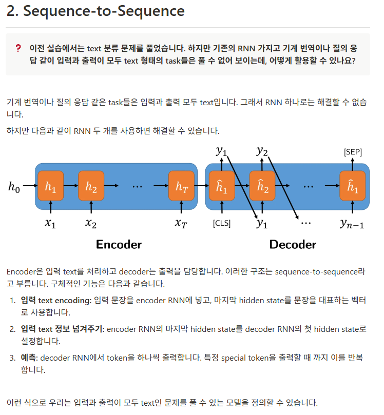
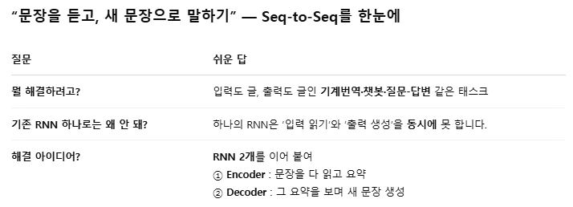
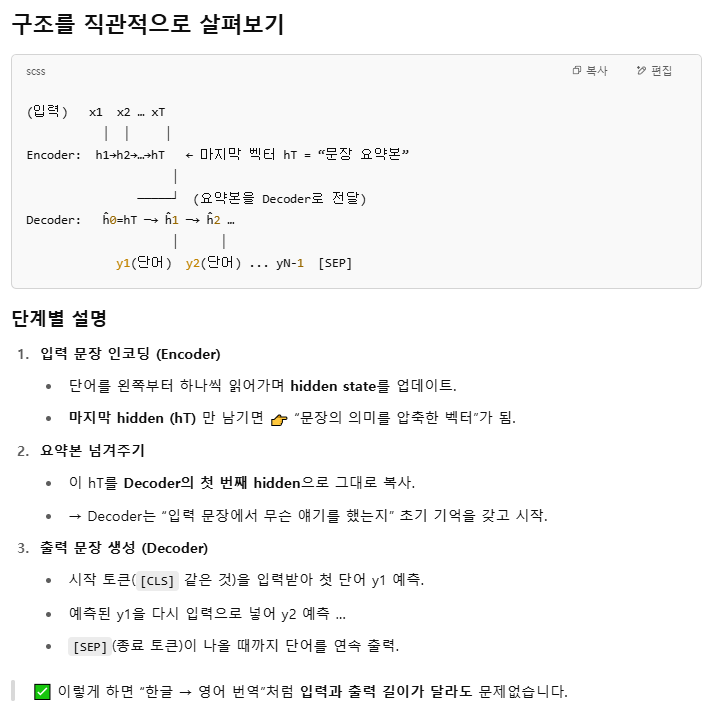
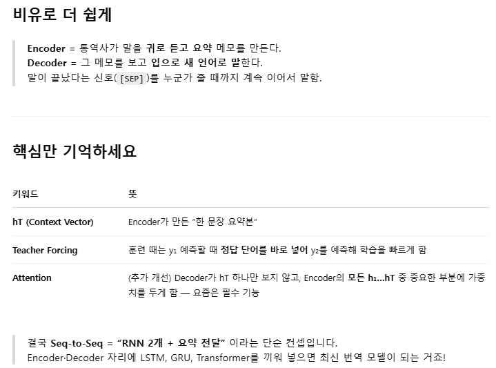
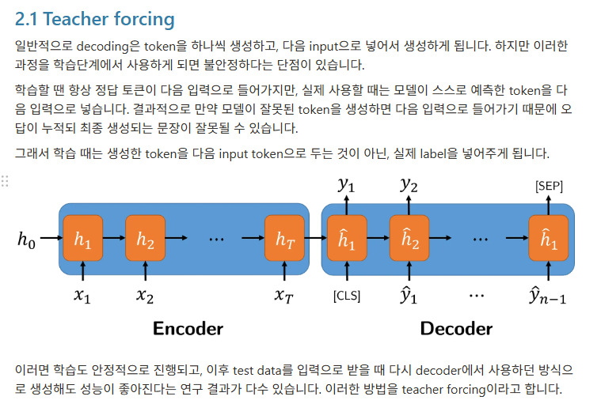
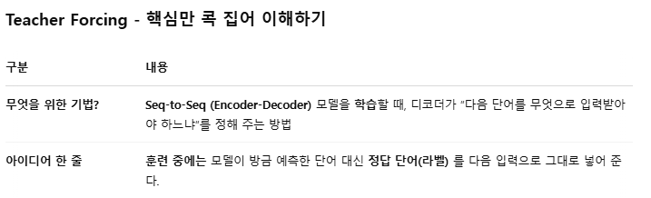
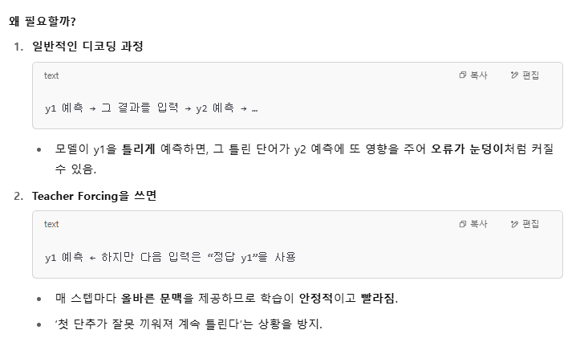
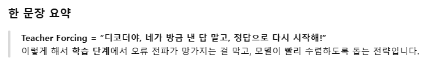
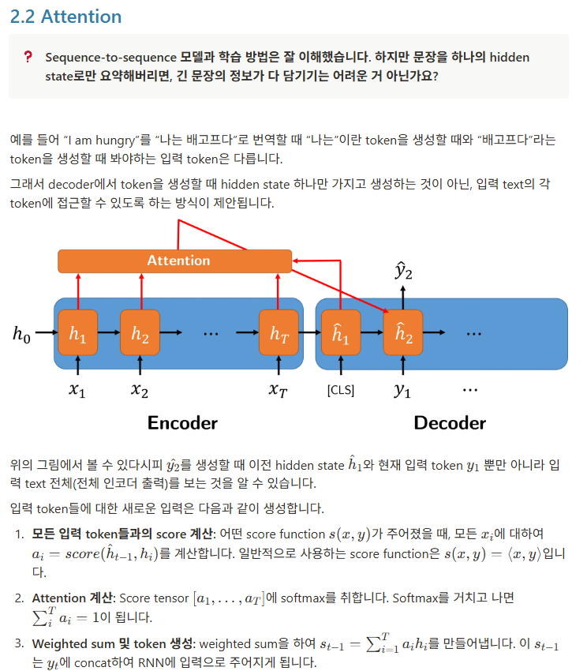
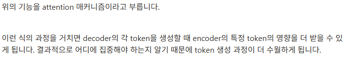
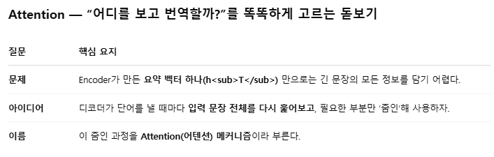
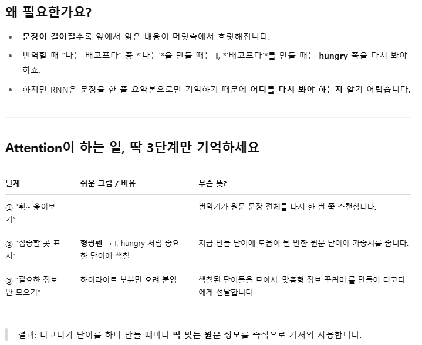
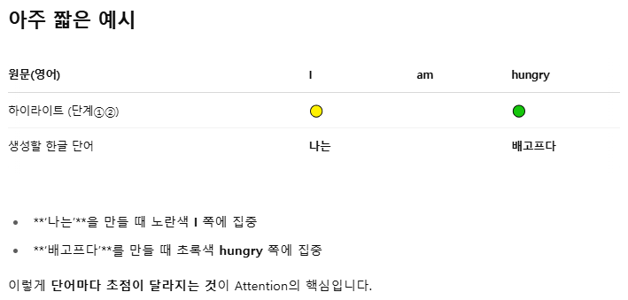
