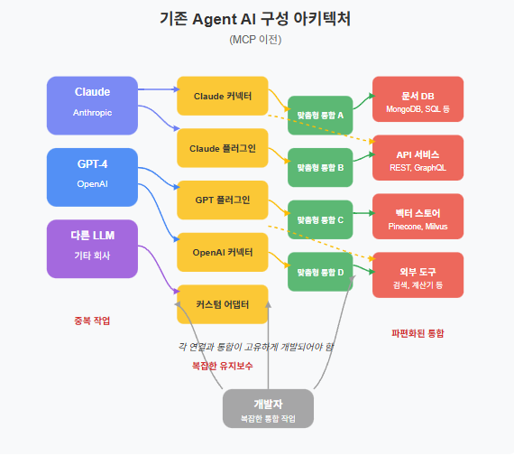
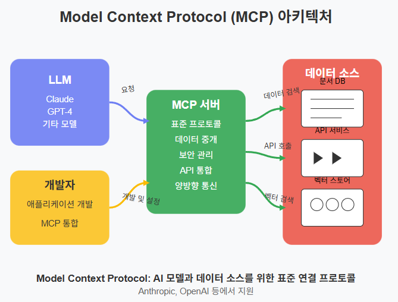
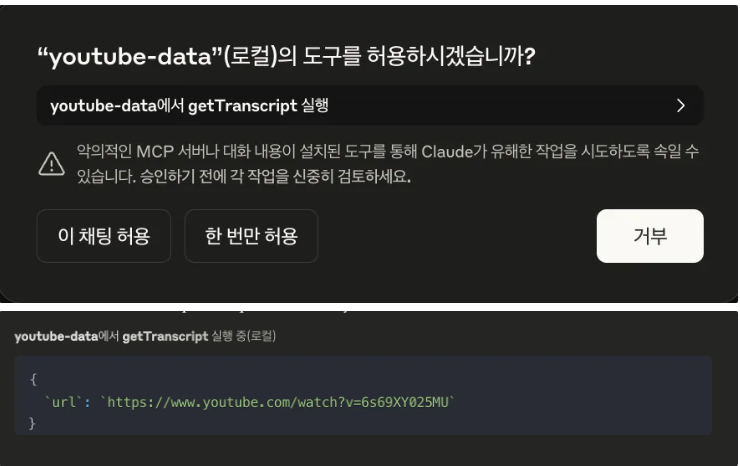

# MCP

## MCP란
- LLM과 데이터 소스 중간다리 역할을 하는 통신 프로토콜



## 작동흐름(Client)
1. 클로드 데스크탑 실행후 MCP 서버 로딩
   - Claude실행시 claude_desktop_config.json 내용확인
   - JSON에 있는 모든 mcp 서버 실행 및 환경변수 로딩
2. 클로드 데스크탑에서 MCP 툴 사용 요청
    - 프롬프트 실행 [사용자: https://www.youtube.com/watch?v=ZFWCcA7AoMQ 요약해줘]
    - LLM이 내부적으로 사용가능한 MCP 도구를 확인
    - MCP 실행권한 요청


## 작동흐름(Server)
- MCP 서버에 getTranscript tool 요청후 내용 리턴
    - LLM이 MCP Server에서 해당되는 툴(getTranscript)을 찾아서 실행

```java
// 클라이언트에서 서버로 요청할 때 사용하는 파라미터 예시
const params = {
  // 처리할 YouTube 영상의 전체 URL 또는 영상 ID        
  url: "https://www.youtube.com/watch?v=6s69XY025MU",
  // 반환받고 싶은 자막 언어 코드 ("ko": 한국어, "en": 영어 등)
  lang: "ko"                                        
};
```

```java
// 1) server.tool 등록부: "getTranscript"라는 이름으로 툴을 등록
server.tool(
  "getTranscript",                             // 툴을 호출할 때 사용할 고유 이름
  "Get transcript/subtitles from a YouTube video", // 툴 설명(자동 문서화 등에 사용)
  {
    // 2) 입력 파라미터 스키마 정의 (zod 사용)
    url: z
      .string()                                 // url은 무조건 문자열이어야 함
      .describe("YouTube video URL or video ID"), // 문서화용 설명
    lang: z
      .string()                                 // lang도 문자열
      .default("en")                            // 값 누락 시 기본 "en" 사용
      .describe('Language code for transcript (e.g., "en", "ko", "ja")') // 설명
  },
  // 3) 실제 호출 핸들러: 비동기 함수로 {url, lang}을 받아 처리
  async ({ url, lang }) => {
    try {
      // 4) 실제 자막+메타정보 수집 로직 호출
      const result = await getTranscriptData({ url, lang });

      // 5) 성공 시 결과를 예쁘게 포매팅(JSON)해서 반환
      return {
        content: [
          {
            type: "text",                     // 응답 콘텐츠 타입
            text: JSON.stringify(result, null, 2) // 2-space 들여쓰기로 보기 좋게 변환
          }
        ]
      };
    } catch (error: any) {
      // 6) 에러 발생 시 에러 메시지만 반환
      return {
        content: [
          {
            type: "text",
            text: `Error: ${error.message || "Unknown error"}` // 메시지가 없으면 "Unknown error"
          }
        ]
      };
    }
  }
);
```

```java
/**
 * YouTube 영상의 메타정보와 자막(트랜스크립트)을 가져오는 함수
 * @param url YouTube URL 또는 영상 ID
 * @param lang 요청할 자막 언어 코드 (기본값 "en")
 * @returns { videoInfo, transcript, fullText, language } 구조의 객체
 */
async function getTranscriptData({ url, lang = "en" }: TranscriptParams) {
  try {
    // 1) URL에서 videoId를 추출
    const videoId = getVideoId(url);
    if (!videoId) {
      // 유효하지 않은 URL/ID면 예외 발생
      throw new Error("Invalid YouTube URL or video ID");
    }

    // 2) 영상의 기본 정보(제목, 채널명, 게시일, 조회수 등) 가져오기
    const videoInfo = await fetchBasicVideoInfo(videoId);

    // 3) YoutubeTranscript 라이브러리로 자막 세그먼트 배열 받아오기
    //    segment = { text, duration, offset, … }
    const transcript = await YoutubeTranscript.fetchTranscript(videoId, { lang });

    // 4) 모든 세그먼트의 text만 뽑아 공백으로 연결 → 전체 자막 문자열 생성
    const fullText = transcript.map(segment => segment.text).join(" ");

    // 5) 필요한 데이터만 골라 구조화하여 반환
    return {
      videoInfo: {
        id: videoId,              // 영상 ID
        title: videoInfo.title,   // 영상 제목
        channelName: videoInfo.channelName, // 채널 이름
        publishedAt: videoInfo.publishedAt, // 게시일
        viewCount: videoInfo.viewCount      // 조회수
      },
      transcript,                // 세그먼트 배열
      fullText,                  // 전체 자막 문자열
      language: lang             // 사용된 언어 코드
    };
  } catch (error) {
    // 문제 발생 시 콘솔에 찍고 예외 재던지기 → 위 핸들러에서 처리
    console.error("Error fetching transcript:", error);
    throw error;
  }
}
```

```java
//최종반환
{
  "videoInfo": {
    "id": "6s69XY025MU",
    "title": "Attention/Transformer 시각화로 설명",
    "publishedAt": "2023-12-18T07:24:27-08:00",
    "viewCount": "35392"
  },
  "transcript": [
    { "text": "[음악]", "duration": 5.96, "offset": 0, "lang": "ko" },
    … 각 자막 세그먼트 …
  ],
  "fullText": "[음악] … 전체 자막 텍스트 …",
  "language": "ko"
}
```
