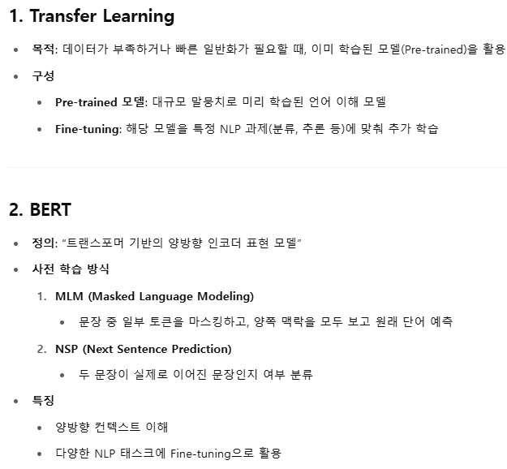
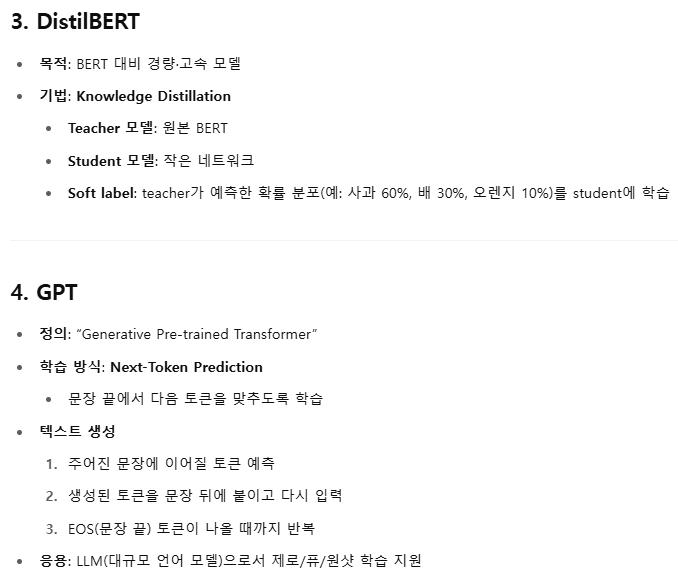
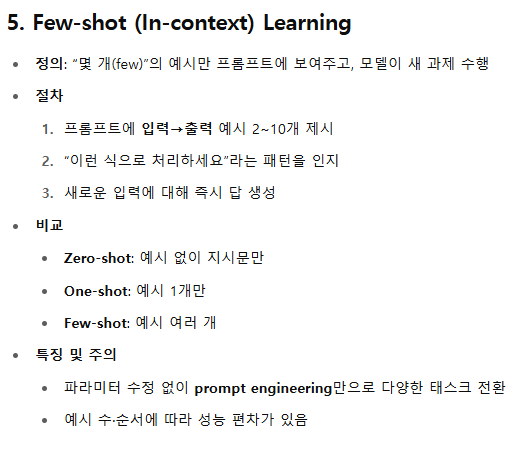
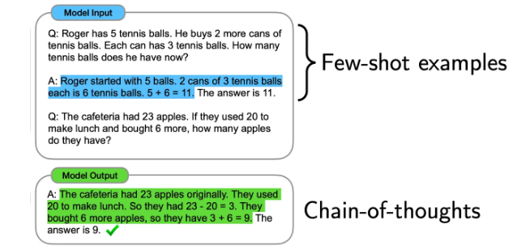
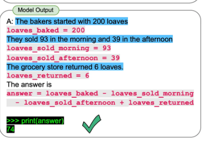

# 요약

## Gradient Descent
- 오차를 줄이기 위해 파라미터 W를 조금씩 조정하는 방법

## Multi-layer Perceptron (MLP)
- 선형회귀로 풀지못하는 문제를 
- 여러개의 선형 함수 + 비선형 함수 추가해서 풀이

## BackPropagation
- MLP를 깊게 쌓아도 gradient를 쉽게 계산하는 법

## SGD

## Dropout

## Adam Optimizer
- 학습률 조절 : 오류가 아주 작게 변하는 상황에서는 학습률을 높여서 빠르게 빠져나오고, 오류가 크게 변할 때는 학습률을 낮춰서 섬세하게 조정
    - 극솟점 근처일 때 learning rate 높이기(Local Minimum 탈출)
    - 극솟점에서 멀 때 learning rate 낮추기(minimum 찾기)

## Tokenizer & Vocabulary

## RNN

## LSTM

## Sequence To Sequence

## Attetion

## Transformer
- 문장 내 모든 단어 간의 관계를 ‘어텐션’ 메커니즘으로 동시 비교하여, 병렬 처리가 가능하면서도 긴 문맥을 효과적으로 학습하는 구조
- 병렬연산 가능

## HuggingFace
- Transformer 구현체 : Text분류, Sequence-to-sequence, Pre-training
- Dataset 및 pre-trained 모델들을 위한 hub
- Trainer

## Prompting
- Chain-of-thoughts (CoT) : 주어진 문제를 풀이와 함께 풀도록 하는 prompting 방법

- Program-aided language model (PAL) : 수학적 연산을 코드로 풀어서 해결

- Retrieval-augmented generation (RAG) : LLM이 인터넷 검색을 통해 자료들을 더 찾아본 뒤 답변을 작성
- [GPT로 prompting 기법들 체험하기](https://github.com/kps990515/AI/tree/main/Lecture/summary/exercise/prompting1)
- [수능 국어 문제 GPT-4로 풀어보기](https://github.com/kps990515/AI/tree/main/Lecture/summary/exercise/prompting2)

## Tuning
- Supervised Fine-tuning (SFT) 
  - 질문과 답변의 쌍으로 이루어진 data를 사용 : 질문까지 답변에 포함시켜버림
  - 나와야 하는 답변에 대해서만 학습을 진행
  - Self-Instruct : 사람이 Instruction 생성 > LLM으로 Instruction, tuning data생성 > 반복
  - GSM-Plus : 숫자를 바꾸거나 문제의 용어들을 바꾸어, 같은 문제에 대해 다양한 variation을 생성
  - UltraChat : 두 개의 LLM끼리 대화하게끔 만들어, 이 대화 내역을 instruction-tuning data로 활용

## Multi-modal Large Language Model (MLLM)
- 여러 가지 형태(modal)의 입력을 받는다고 해서 MLLM

## RAG
- 인터넷 자료와 같은 외부 data source를 활용하도록 하는 기술
  - 사용자의 질문 입력
  - Knowledge source로 부터 유사한 자료 추출
  - 추출한 자료들과 사용자 질문으로 prompt 구성
  - Prompt에 대한 LLM의 답변 반환