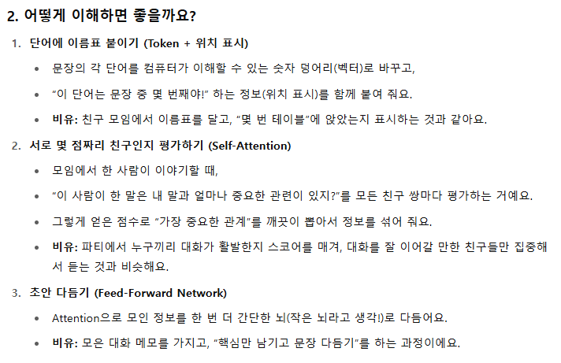

# 요약

## Gradient Descent
- 오차를 줄이기 위해 파라미터 W를 조금씩 조정하는 방법

## Multi-layer Perceptron (MLP)
- 선형회귀로 풀지못하는 문제를 
- 여러개의 선형 함수 + 비선형 함수 추가해서 풀이

## BackPropagation
- MLP를 깊게 쌓아도 gradient를 쉽게 계산하는 법

## SGD

## Dropout

## Adam Optimizer
- 학습률 조절 : 오류가 아주 작게 변하는 상황에서는 학습률을 높여서 빠르게 빠져나오고, 오류가 크게 변할 때는 학습률을 낮춰서 섬세하게 조정
    - 극솟점 근처일 때 learning rate 높이기(Local Minimum 탈출)
    - 극솟점에서 멀 때 learning rate 낮추기(minimum 찾기)

## Tokenizer & Vocabulary

## RNN

## LSTM

## Sequence To Sequence

## Attetion

## Transformer
- Transformer는 RNN 없이 순수하게 어텐션(attention) 연산만으로 입력된 토큰들의 순서 정보를 반영해 문장 표현을 뽑아내는 모델 구조
- 병렬연산 가능

