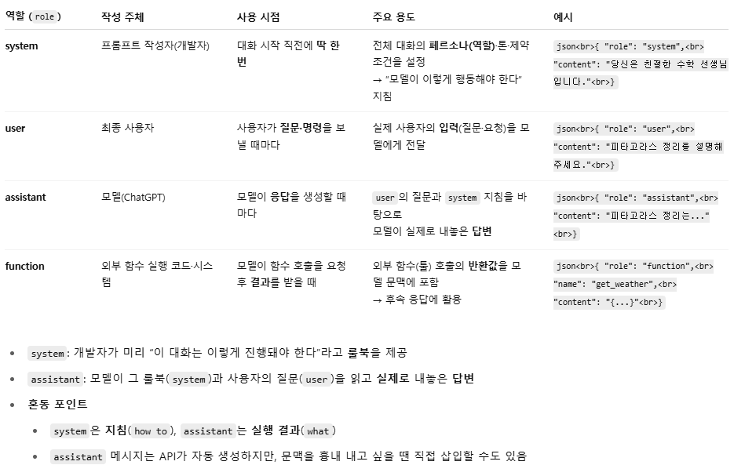

# GPT로 prompting 기법들 체험하기

## Role


패키지 설치 및 임포트
```python
!pip install openai datasets
```

API 키 설정 및 클라이언트 초기화
```python
from openai import OpenAI
from google.colab import userdata

# Colab 환경에서 환경변수로부터 키 읽기
client = OpenAI(api_key=userdata.get('OPENAI_API_KEY'))
```

파라미터 정의
```python
temperature = 0.5        # 값이 낮을수록 결정적, 높을수록 창의적
max_tokens = 4096        # 최대 생성 토큰 수
n = 5                    # 동일 질의 시도 횟수
frequency_penalty = 0.0  # 반복 단어 억제
```

제로-샷(예시없이 지시문만)
```python
user_prompt = "List the subjects in Euclidean plane geometry."
message = [
  # user의 역할로 user_prompt를 GPT에 입력
  {"role": "user", "content": user_prompt}
]
response = client.chat.completions.create(
  model="gpt-4o",           # 사용할 모델 이름
  messages=message,          # 위에서 만든 대화 내역
  n=1,                       # 생성할 응답 개수
  max_tokens=max_tokens,     # 응답에 쓸 최대 토큰 수
  temperature=0.0,           # 출력의 무작위성 조절 (0.0 = 가장 결정적)
  frequency_penalty=frequency_penalty  # 반복 단어 사용 억제 강도
)
print(response.choices[0].message.content)
```

감성 분류 실습: Few‑Shot
```python
from datasets import load_dataset

imdb = load_dataset("imdb")
imdb['train'] = imdb['train'].shuffle()

# Few-Shot Example 학습
prompt = "Is the following movie review positive or negative?\n\n"

for i in range(10):
  text  = imdb["train"][i]["text"]
  label = imdb["train"][i]["label"]

  sub_prompt = "Review: " + text
  if label == 0:
    sub_prompt += "\nAnswer: negative\n\n"
  else:
    sub_prompt += "\nAnswer: positive\n\n"
  prompt += sub_prompt

prompt += "Review: "
print(prompt)
# Is the following movie review positive or negative?
# Review: in 1976 i had just moved to the us from ceylon. i was 23, and had been married for a little over three years, and was beginning to come out as a lesbian. i saw this movie on an old black and white TV, with terrible reception, alone, and uninterrupted, in an awakening that seemed like an echo of the story. i was living in a small house in tucson arizona, and it was summertime... like everyone else here, i never forgot the feelings the images of this story called forth, and its residue of fragile magic, and i have treasured a hope that i would see it again someday. i'll keep checking in. i also wish that someone would make a movie of shirley verel's 'the other side of venus'. it also has some of the same delicacy and persistent poignancy...
# Answer: positive
```

Few-Shot 분류 요청 & 결과
```python
message = [{
    "role": "user",
    # 앞서 만든 prompt 에 imdb["test"][123]["text"] 를 이어 붙이고
    # "\nAnswer: " 까지 추가하여, 모델이 바로 답을 채워 넣도록 합니다.
    "content": prompt + imdb["test"][123]["text"] + "\nAnswer: "
}]
response = client.chat.completions.create(
    model="gpt-4o",
    messages=message,
    n=1,
    max_tokens=max_tokens,
    temperature=temperature,
    frequency_penalty=frequency_penalty
)
print(response.choices[0].message.content)
# negative
```

수학 문제 풀이 (Chain‑of‑Thought)
```python
problem_easy = "Roger has 5 tennis balls. He buys 2 more cans of tennis balls. Each can has 3 tennis balls. How many tennis balls does he have now?"
problem_hard = "At time \\(t = 0\\), starting simultaneously from the origin … What is the total distance that point \\(Q\\) has moved from time \\(t = a\\) to \\(t = b\\)? (Note that \\(0 < a < b\\))"

assistant_prompt = "You are an highschool student who is a mathematician."
 # COT
 + "Solve the problem using code interpreter step by step, even in every sub-step"
user_prompt = problem_easy

message = [
  # assistant 역할: 모델 스스로가 “나는 고등학생 수학자야”라고 이미 말해 둔 듯한 문맥을 만듭니다.
  # 권장하는 방식은 이 지침을 system 역할로 넣는 것이지만,
  # 이전에 assistant가 이렇게 말했었다”는 흐름을 흉내 내기 위해 assistant 역할을 쓴 트릭
  {"role": "assistant", "content": assistant_prompt},
  {"role": "user",      "content": user_prompt}
]

response = client.chat.completions.create(
  model="gpt-4o",
  messages=message,
  n=1,
  max_tokens=max_tokens,
  temperature=temperature,
  frequency_penalty=frequency_penalty
)
```

수학 문제 풀이 (PAL)
```python
# 모델에게 각 서브스텝마다 파이썬 코드를 쓰고, Code Interpreter(코드 실행 툴)로 실제로 계산하라고 요구
user_prompt = problem_hard + "Solve the problem by using code interpreter in every sub-step."

message=[{"role": "assistant", "content": assistant_prompt}, {"role": "user", "content": user_prompt}]
response = client.chat.completions.create(
    model="gpt-4o",
    messages=message,
    n=1,
    max_tokens=max_tokens,
    temperature=0.0,
    frequency_penalty=frequency_penalty
)
print(response.choices[0].message.content)
```