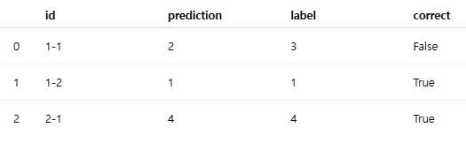

# 수능 국어 문제 GPT-4로 풀어보기

패키지 설치 및 임포트
```python
!pip install openai requests

import json
import requests
from openai import OpenAI
import pandas as pd
```

문제 데이터 불러오기
```python
url = "https://…/2023_11_KICE.json"
response = requests.get(url) 
problems_data = json.loads(response.text) # 리스트 of 딕셔너리 형태(problems_data)로 변환
```

OpenAI 클라이언트 초기화
```python
client = OpenAI() # OpenAI 클라이언트 초기화
```

prediction 함수 정의
```python
def prediction(problem):
  # 1) 시스템 메시지 : 모델에게 “국어 전문가” 역할을 주고, “답은 1,2,3… 숫자 하나만 출력” 하도록 지시
  system_content = (
    "You are a Korean language test expert. "
    "…Indices start at 1."
  )
  # 2) 사용자 메시지 : 실제 문제 지문과 선택지 리스트를 포맷에 맞춰 문자열로 생성
  user_content = (
    # {problem['question']} → problem 딕셔너리의 "question" 키에 해당하는 값을 문자열로 치환
    f"Question: {problem['question']}\n"
    f"Choices: {problem['choices']}"
  )
  # 3) 메시지 묶음 생성
  messages = [
    {"role": "system", "content": system_content}, # 프롬프트
    {"role": "user",   "content": user_content} # 질문
  ]
  # 4) 모델 호출
  completion = client.chat.completions.create(
    model="gpt-4o",
    messages=messages,
  )
  # 5) 답변 텍스트 추출
  return completion.choices[0].message.content.strip()
```

전체문제에 대한 예측, 채점
```python
results = []
for item in problems_data:
  pred = prediction(item) # GPT의 답
  # id(문제), prediction(예측 답), 실제 정답(label)을 딕셔너리로 묶어 results 에 추가
  results.append({ 
    "id":         item["id"],
    "prediction": pred,
    "label":      str(item["answer"])
  })
df_results = pd.DataFrame(results)
# correct라는 Boolean 컬럼을 새로 생성해 true, false 노출
df_results["correct"] = df_results.prediction == df_results.label

correct = df_results.correct.sum()
total   = len(df_results)
accuracy = correct / total * 100

print(f"Correct: {correct}/{total}")
print(f"Score: {accuracy:.2f}%")
```



## Tuning
- Supervised Fine-tuning (SFT) 
  - 질문과 답변의 쌍으로 이루어진 data를 사용 : 질문까지 답변에 포함시켜버림
  - 나와야 하는 답변에 대해서만 학습을 진행
  - Self-Instruct : 사람이 Instruction 생성 > LLM으로 Instruction, tuning data생성 > 반복
  - GSM-Plus : 숫자를 바꾸거나 문제의 용어들을 바꾸어, 같은 문제에 대해 다양한 variation을 생성
  - UltraChat : 두 개의 LLM끼리 대화하게끔 만들어, 이 대화 내역을 instruction-tuning data로 활용

## Multi-modal Large Language Model (MLLM)
- 여러 가지 형태(modal)의 입력을 받는다고 해서 MLLM

## RAG
- 인터넷 자료와 같은 외부 data source를 활용하도록 하는 기술
  - 사용자의 질문 입력
  - Knowledge source로 부터 유사한 자료 추출
  - 추출한 자료들과 사용자 질문으로 prompt 구성
  - Prompt에 대한 LLM의 답변 반환