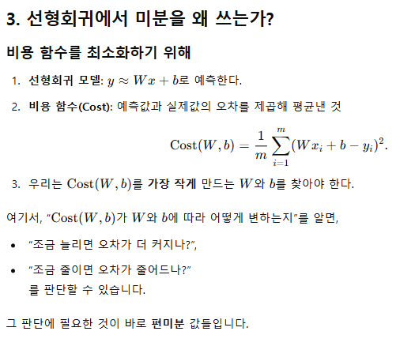

## 선형 회귀(Linear Regression) 간단 요약

### 1. 어떤 문제를 풀고 싶은가?
- 예시: "사람의 키(입력)가 주어졌을 때, 몸무게(출력)를 예측하고 싶다."
- 입력(X)과 출력(Y) 사이에 규칙이 있다고 가정하고, 이를 하나의 직선(함수)으로 표현합니다.
- 데이터를 모아 놓고, Y = W x X + b라는 직선을 찾아 새로운 X가 들어오면 Y를 예측합니다.

### 2. 데이터를 직선으로 맞춘다는 의미
- 데이터가 (x1, y1), (x2, y2), \dots 형태로 주어졌을 때, "이 점들을 가장 잘 통과(또는 근접)하는 직선"을 찾습니다.
- 여기서 "가장 잘"이란 오차(실제값 - 예측값)가 작은 직선을 찾는 것입니다.

### 3. 오차(비용) 측정 방법
- (실제값 - 예측값)을 구해 그 차이를 제곱하고 평균을 냅니다.
- 제곱하는 이유는 양수, 음수를 구분하지 않고 큰 오차에 더 많은 벌점을 주기 위해서입니다.
- 이 제곱 평균값을 **비용(Cost)** 또는 **오차(에러) 지표**라고 합니다.
- 목표는 이 비용을 최소로 만드는 W와 b를 찾는 것입니다.

### 4. 직선을 찾는 대표 방법
#### 경사 하강법(Gradient Descent)
- 임의의 직선에서 시작해 오차를 확인하고, 오차가 줄어드는 방향으로 조금씩 W, b를 바꿔 반복하며 최적의 직선을 찾습니다.

#### 공식(닫힌 형태 해, Normal Equation)
- 통계적 방법(평균, 공분산 등)을 이용해 W, b를 수학적으로 바로 계산하는 방법입니다.
- 데이터의 차원이 많아질수록 계산이 복잡해지며, 그런 경우 경사 하강법이 주로 사용됩니다.

### 5. 최종 결과
- 방법과 무관하게 최종적으로 y = Wx + b 형태의 최적 직선을 얻습니다.
- 이 직선으로 새로운 x 값이 들어오면 쉽게 예측값 y를 계산할 수 있습니다.

### 6. 요점 정리
- **데이터**: (x1, 1), (2, 2), \dots
- **모델(직선) 가정**: 𝑦 ≈ 𝑊 𝑥 + b

- **오차(비용) 정의**: (실제값 - 예측값)의 제곱 평균값
- **오차 최소화**: 최적의 W, b를 찾기
    - **경사 하강법**: 반복적인 접근 방법
    - **공식(Normal Equation)**: 통계적 개념을 이용한 즉각적 계산 방법
- **결과**: 데이터를 가장 잘 설명하는 직선

### 7. 핵심 (수학 없이 기억하기)
- "오차를 최소화하는 직선을 찾는 것"이 선형회귀의 본질입니다.
- 제곱하는 이유는 큰 오차에 더 큰 벌점을 주고 음수, 양수를 구분하지 않기 위함입니다.
- 경사 하강법은 오차가 줄어드는 방향으로 파라미터를 조정하는 방법입니다.
- 공식(닫힌 해)은 통계적 개념을 이용해 파라미터를 한 번에 계산하는 것입니다.
- 결국, 최적의 두 숫자 W와 b를 찾는 것이 핵심이며, 이를 이용해 새로운 값을 예측합니다.

간단히 정리하면:
- **"흩어진 점들에 가장 잘 맞는 직선 하나를 그리는 것"**
- **"그 직선이 잘 맞는지 오차(제곱)를 계산하여 최소화하는 것"**

이것이 선형회귀의 전부입니다.

