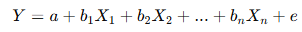
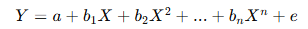
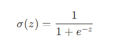
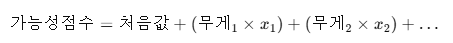
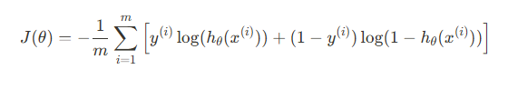
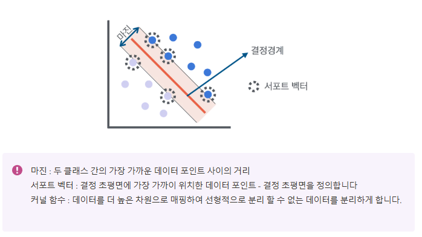
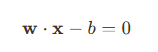
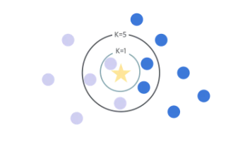
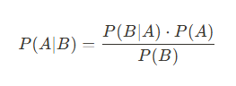
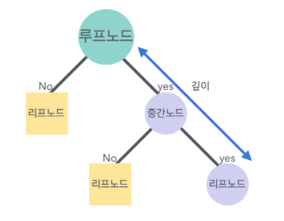

# 머신러닝 지도학습: 회귀모델 쉽게 이해하기

# 머신러닝 지도학습: 회귀모델 쉽게 이해하기

## 📌 **머신러닝 지도학습 모델 요약**

| 모델 | 용도 및 목적 | 주요 특징 |
|------|------------|-----------|
| 선형 회귀 | 연속적인 값 예측 | 데이터를 가장 잘 나타내는 직선 찾기 |
| 다항 회귀 | 비선형적인 데이터 예측 | 곡선 형태로 데이터를 표현 |
| 로지스틱 회귀 | 두 가지 결과 중 분류 | 확률로 데이터를 분류 |
| 서포트 벡터 머신(SVM) | 분류 및 예측 | 데이터 간의 최대 마진으로 분류 |
| K 최근접 이웃(KNN) | 간단한 분류 및 예측 | 주변의 가장 가까운 이웃으로 분류 |
| 나이브 베이즈 | 텍스트 분류 및 예측 | 확률적 접근으로 빠르게 분류 |
| 의사결정나무 | 직관적 분류 및 예측 | 데이터를 질문 형태로 나누어 최종 예측 |

---

(각 모델에 대한 기존 설명은 아래 내용을 참조하세요.)


## 📌 **1. 선형 회귀 (Linear Regression)**

### ✅ 선형 회귀란?
선형 회귀는 **하나 이상의 독립변수(X)**와 **하나의 종속변수(Y)** 간의 관계를 **직선 형태로 나타내는 방법**입니다.

- **단순 선형 회귀**: 독립변수가 1개일 때 사용합니다.
- **다중 선형 회귀**: 독립변수가 여러 개일 때 사용합니다.

### ✅ 쉬운 수식 설명

- **단순 선형 회귀 수식**:

Y = a + bX + e

- Y: 예측하고 싶은 값 (종속변수)
- X: 예측에 사용하는 값 (독립변수)
- a: 선이 시작하는 위치 (절편)
- b: 선의 기울기
- e: 예측과 실제 값의 차이 (오차)

- **다중 선형 회귀 수식**:



- 여러 개의 X로 Y를 예측하는 방식입니다.

### ✅ Python 코드 예제 (주석 포함)

```python
# 필요한 라이브러리 불러오기
import numpy as np
from sklearn.model_selection import train_test_split
from sklearn.linear_model import LinearRegression
from sklearn.metrics import mean_squared_error, r2_score

# 간단한 데이터 생성
X = np.array([[1], [2], [3], [4], [5], [6]])  # 독립변수
y = np.array([2, 4, 6, 8, 10, 12])  # 종속변수

# 데이터 분할 (학습 및 테스트)
X_train, X_test, y_train, y_test = train_test_split(X, y, test_size=0.2)

# 선형 회귀 모델 생성 및 학습
model = LinearRegression()
model.fit(X_train, y_train)

# 예측
y_pred = model.predict(X_test)

# 평가 (오차가 적을수록 좋은 모델)
mse = mean_squared_error(y_test, y_pred)  # 평균 제곱 오차
r2 = r2_score(y_test, y_pred)  # 예측 정확도 (1에 가까울수록 좋음)
print(f'MSE(오차): {mse}')
print(f'R² 점수(정확도): {r2}')
```

## 📌 **2. 다항 회귀 (Polynomial Regression)**

### ✅ 다항 회귀란?
다항 회귀는 **직선이 아닌 곡선 형태로 데이터를 예측**할 때 사용합니다.

### ✅ 쉬운 수식 설명



- **X², X³** 등의 항이 추가되어 더 복잡한 관계를 표현합니다.

### ✅ Python 코드 예제

```python
import numpy as np
from sklearn.preprocessing import PolynomialFeatures
from sklearn.linear_model import LinearRegression
from sklearn.metrics import mean_squared_error, r2_score
from sklearn.model_selection import train_test_split

X = np.array([[1], [2], [3], [4], [5], [6]])
y = np.array([1, 4, 9, 16, 25, 36])

# 다항식 특성 추가 (차수=2)
poly = PolynomialFeatures(degree=2)
X_poly = poly.fit_transform(X)

X_train, X_test, y_train, y_test = train_test_split(X_poly, y, test_size=0.2)

model = LinearRegression()
model.fit(X_train, y_train)

y_pred = model.predict(X_test)

mse = mean_squared_error(y_test, y_pred)
r2 = r2_score(y_test, y_pred)
print(f'MSE(오차): {mse}')
print(f'R² 점수(정확도): {r2}')
```

## 📌 **3. 로지스틱 회귀 (Logistic Regression)**

### ✅ 로지스틱 회귀란?
로지스틱 회귀는 두 가지 결과 중 하나를 고르는 방법이에요. 예를 들어, "비가 올까요 안 올까요?", "시험에 합격할까요 떨어질까요?"와 같은 질문에 답할 때 사용합니다.

- 회귀라는 이름이 붙어 있지만, 실제로는 **분류(구분하기)**를 위한 방법이에요.

### ✅ 시그모이드 함수 (Sigmoid Function)
시그모이드 함수는 우리가 어떤 일이 일어날 확률을 0과 1 사이로 나타내주는 특별한 계산법이에요.

- 큰 숫자가 들어가면 결과는 1에 가까워지고, 작은 숫자가 들어가면 결과는 0에 가까워져요.

쉽게 말하면 이렇게 계산해요:



- 여기서 z는 우리가 구한 값이에요. 간단히 말하면, "가능성 점수"라고 생각하면 돼요:



### ✅ 로지스틱 회귀의 목적
로지스틱 회귀는 어떤 사건이 일어날지 안 일어날지 그 확률을 맞추는 게 목적이에요.

- 예를 들어, "내일 비가 올 확률이 0.9"라면 90%로 비가 올 가능성이 높은 거예요.

### ✅ 비용 함수 (Cost Function)
비용 함수는 "얼마나 잘 맞췄는지"를 점수로 매기는 계산법이에요.

쉽게 표현하면:
- 맞추면 점수가 낮아지고, 틀리면 점수가 높아져요.
- 목표는 이 점수를 가능한 가장 작게 만드는 거예요.

아래는 비용 함수의 공식이에요 (조금 복잡해도 괜찮아요!):



- 여기서 y는 실제 일어난 결과이고, h는 우리가 예측한 결과(확률)이에요.
- 이 공식의 의미는 예측한 확률이 실제 결과와 얼마나 다른지 나타내는 점수를 매긴다는 거예요.

### ✅ Python 코드 예제 (주석 포함)
```python
import numpy as np
from sklearn.model_selection import train_test_split
from sklearn.linear_model import LogisticRegression
from sklearn.metrics import accuracy_score

# 간단한 데이터 생성
X = np.array([[1], [2], [3], [4], [5], [6]])  # 독립변수
y = np.array([0, 0, 0, 1, 1, 1])  # 종속변수(두 가지 분류)

# 데이터 분할 (훈련과 테스트)
X_train, X_test, y_train, y_test = train_test_split(X, y, test_size=0.2)

# 로지스틱 회귀 모델 생성 및 학습
model = LogisticRegression()
model.fit(X_train, y_train)

# 예측
y_pred = model.predict(X_test)

# 정확도 평가
accuracy = accuracy_score(y_test, y_pred)
print(f'정확도: {accuracy}')
```

## 📌 **4. 서포트 벡터 머신 (Support Vector Machine, SVM)**

### ✅ SVM이란?
서포트 벡터 머신(SVM)은 데이터가 어떤 그룹에 속하는지 분류하는 데 사용하는 방법이에요. 선을 그어 데이터를 나누는데, 그 선을 "결정 경계" 또는 "초평면"이라고 해요.

- 이 선을 그을 때 데이터와 최대한 멀리 떨어지도록 합니다. 이렇게 해서 새로운 데이터를 더 잘 맞추게 돼요.



### ✅ SVM의 목적
SVM의 목적은 두 데이터 그룹을 나누는 선(결정 경계)을 최대한 데이터를 잘 분리하도록 만드는 것이에요.

간단한 공식으로 표현하면:



- w(가중치 벡터)와 x(데이터 포인트)를 곱하고, 여기서 b(절편)를 빼면 결정 경계를 나타내는 식이 돼요.

### ✅ SVM의 장점
- 잘 작동하며 과적합(데이터에 너무 맞춰 학습하는 것)을 방지할 수 있어요.
- 적은 데이터로도 좋은 성능을 보여요.

### ✅ Python 코드 예제 (주석 포함)
```python
import numpy as np
from sklearn.model_selection import train_test_split
from sklearn.svm import SVC
from sklearn.metrics import accuracy_score

# 간단한 데이터 생성
X = np.array([[1], [2], [3], [4], [5], [6]])  # 독립변수
y = np.array([0, 0, 0, 1, 1, 1])  # 종속변수 (두 가지 분류)

# 데이터 분할 (훈련과 테스트)
X_train, X_test, y_train, y_test = train_test_split(X, y, test_size=0.2)

# SVM 모델 생성 및 학습
model = SVC(kernel='linear')  # kernel='linear': 직선으로 나눌 때 사용
model.fit(X_train, y_train)

# 예측
y_pred = model.predict(X_test)

# 정확도 평가
accuracy = accuracy_score(y_test, y_pred)
print(f'정확도: {accuracy}')
```

## 📌 **5. K 최근접 이웃 (K-Nearest Neighbors, KNN)**

### ✅ KNN이란?
KNN은 주변의 이웃을 보고 새로운 데이터가 어느 그룹에 속하는지 결정하는 간단한 방법이에요.

- 새로운 데이터가 들어오면, 주변에 있는 가장 가까운 K개의 데이터를 살펴봅니다.
- 가장 많이 속해 있는 그룹에 새 데이터를 넣는 방식으로 결정해요.

### ✅ 쉬운 용어 설명

- **거리 측정**: 데이터 사이의 거리를 재서 얼마나 가까운지 판단해요. 보통 유클리드 거리를 사용해요.
- **K값**: 몇 개의 이웃을 확인할지 정하는 숫자예요. 작은 K는 주변 데이터에 더 민감하고, 큰 K는 더 일반적인 경계를 만들어요.
- **다수결 투표**: K개의 이웃 중 가장 많은 그룹에 속하는 그룹으로 새로운 데이터를 분류해요.

### ✅ KNN의 목적
KNN의 목적은 주변의 이웃 데이터를 기준으로 새로운 데이터가 어떤 그룹에 속할지를 예측하는 것입니다. 간단하지만 매우 효과적인 방법입니다.

### ✅ KNN의 장점
- 간단하고 이해하기 쉬워요.
- 복잡한 데이터에도 잘 적용할 수 있어요.

### ✅ Python 코드 예제 (주석 포함)
```python
import numpy as np
from sklearn.model_selection import train_test_split
from sklearn.neighbors import KNeighborsClassifier
from sklearn.metrics import accuracy_score

# 간단한 데이터 생성
X = np.array([[1], [2], [3], [4], [5], [6]])  # 독립변수
y = np.array([0, 0, 0, 1, 1, 1])  # 종속변수 (두 가지 분류)

# 데이터 분할 (훈련과 테스트)
X_train, X_test, y_train, y_test = train_test_split(X, y, test_size=0.2)

# KNN 모델 생성 및 학습 (K=3)
model = KNeighborsClassifier(n_neighbors=3)
model.fit(X_train, y_train)

# 예측
y_pred = model.predict(X_test)

# 정확도 평가
accuracy = accuracy_score(y_test, y_pred)
print(f'정확도: {accuracy}')
```

## 📌 **6. 나이브 베이즈 (Naive Bayes)**

### ✅ 나이브 베이즈란?
나이브 베이즈는 데이터를 분류할 때 사용하는 간단하고 빠른 방법이에요. 특히 텍스트 분류(예: 이메일 스팸 여부 판단)에 많이 사용돼요.

- 나이브(순진한)라는 이름이 붙은 이유는 각 데이터의 특징이 서로 독립적(서로 관련이 없다고)이라고 가정하기 때문이에요.

### ✅ 베이즈 정리란?
베이즈 정리는 어떤 사건이 일어날 확률을 계산하는 방법이에요.

- 간단한 공식:


쉽게 말하면:
- **P(A|B)**: B가 일어난 후 A가 일어날 확률 (우리가 알고 싶은 확률)
- **P(B|A)**: A가 일어났을 때 B가 일어날 확률
- **P(A)**: A가 일어날 확률 (원래 일어날 확률)
- **P(B)**: B가 일어날 확률 (원래 일어날 확률)

### ✅ 나이브 베이즈의 종류
- **가우시안 나이브 베이즈**: 숫자 데이터가 정규분포(일반적으로 많이 나타나는 분포)를 따른다고 가정할 때 사용해요.
- **베르누이 나이브 베이즈**: 데이터가 두 가지 값만 가질 때 사용해요 (예: 예/아니오).
- **멀티노미얼 나이브 베이즈**: 데이터가 여러 가지 범주로 나눠져 있을 때 사용해요 (텍스트 데이터를 다룰 때 많이 사용).

### ✅ 나이브 베이즈의 목적
나이브 베이즈의 목적은 주어진 데이터가 특정 그룹에 속할 확률을 계산해서 분류하는 거예요. 간단하고 빠르게 결과를 얻을 수 있어요.

### ✅ 나이브 베이즈의 장점
- 매우 빠르게 계산할 수 있어요.
- 복잡한 데이터에 대해서도 좋은 성능을 보여줘요.

### ✅ Python 코드 예제 (주석 포함)
```python
import numpy as np
from sklearn.model_selection import train_test_split
from sklearn.naive_bayes import GaussianNB
from sklearn.metrics import accuracy_score

# 간단한 데이터 생성
X = np.array([[1], [2], [3], [4], [5], [6]])  # 독립변수
y = np.array([0, 0, 0, 1, 1, 1])  # 종속변수 (두 가지 분류)

# 데이터 분할 (훈련과 테스트)
X_train, X_test, y_train, y_test = train_test_split(X, y, test_size=0.2)

# 나이브 베이즈 모델 생성 및 학습
model = GaussianNB()
model.fit(X_train, y_train)

# 예측
y_pred = model.predict(X_test)

# 정확도 평가
accuracy = accuracy_score(y_test, y_pred)
print(f'정확도: {accuracy}')
```

## 📌 **7. 의사결정나무 (Decision Tree)**

### ✅ 의사결정나무란?
의사결정나무는 데이터를 나누는 규칙을 나무 모양으로 그려서, 데이터를 분류하거나 예측하는 방법이에요. 질문을 하면서 데이터를 점점 더 잘게 나누어 가며 최종적으로 결정을 내리는 방식입니다.

- **루트 노드**: 시작하는 첫 질문(전체 데이터)
- **내부 노드**: 데이터를 나누는 추가 질문
- **리프 노드**: 최종적으로 결정된 결과(분류된 클래스)

### ✅ 주요 용어 설명

- **노드(Node)**: 데이터에 대해 질문하는 지점이에요.
- **루트 노드(Root Node)**: 나무의 가장 위에 있는 첫 번째 질문입니다.
- **리프 노드(Leaf Node)**: 더 이상 나눌 수 없는 최종 결과(분류된 데이터)를 나타내요.
- **깊이(Depth)**: 루트 노드에서 리프 노드까지 가장 긴 경로의 길이입니다.

### ✅ 분할 기준
- **정보 이득(Information Gain)**: 얼마나 데이터를 잘 나누었는지 알려주는 방법이에요. 불확실성을 나타내는 엔트로피(Entropy)가 얼마나 줄었는지 계산해요.

쉽게 표현하면:
정보이득 = 원래 불확실성 - 나눈 후 불확실성

- **지니 계수(Gini Index)**: 데이터가 얼마나 섞여있는지(불순도)를 나타내요. 지니 계수가 작을수록 잘 나눈 거예요.

지니 계수 = 1 - (각 클래스 비율의 제곱합)

### ✅ 의사결정나무의 목적
의사결정나무는 데이터를 나누는 규칙을 만들어서 새로운 데이터가 어떤 결과로 이어질지 쉽게 예측하게 하는 것이 목적이에요.

### ✅ 의사결정나무의 장점
- 결과를 쉽게 이해하고 설명할 수 있어요.
- 데이터 전처리가 크게 필요하지 않아요.

### ✅ Python 코드 예제 (주석 포함)
```python
import numpy as np
from sklearn.model_selection import train_test_split
from sklearn.tree import DecisionTreeClassifier
from sklearn.metrics import accuracy_score

# 간단한 데이터 생성
X = np.array([[1], [2], [3], [4], [5], [6]])  # 독립변수
y = np.array([0, 0, 0, 1, 1, 1])  # 종속변수 (두 가지 분류)

# 데이터 분할 (훈련과 테스트)
X_train, X_test, y_train, y_test = train_test_split(X, y, test_size=0.2)

# 의사결정나무 모델 생성 및 학습
model = DecisionTreeClassifier()
model.fit(X_train, y_train)

# 예측
y_pred = model.predict(X_test)

# 정확도 평가
accuracy = accuracy_score(y_test, y_pred)
print(f'정확도: {accuracy}')
```