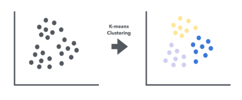
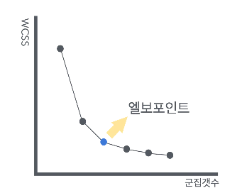
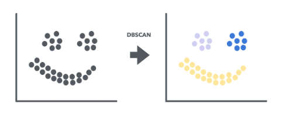
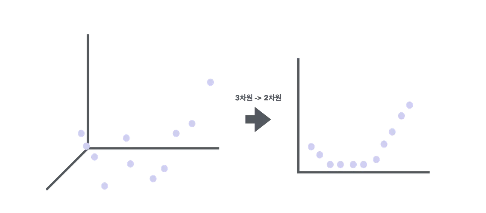
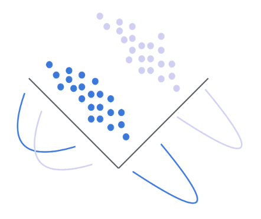

# 머신러닝 비지도학습 모델 정리

## 📌 **비지도학습 모델 한눈에 보기**

| 모델 | 용도 및 목적 | 주요 특징 |
|------|------------|-----------|
| K-means 클러스터링 | 데이터 군집화 | 거리 기반으로 데이터를 K개 군집으로 나눔 |
| 계층적 군집화 | 데이터의 계층적 군집화 | 점진적 병합 또는 분리를 통한 군집 생성 |
| DBSCAN | 밀도 기반 군집화 | 밀도 높은 지역을 군집으로 처리하며, 노이즈 처리 가능 |
| PCA (주성분 분석) | 차원 축소 및 데이터 시각화 | 주요 특성을 추출하여 차원을 축소함 |
| t-SNE | 비선형 차원 축소 및 시각화 | 고차원 데이터를 저차원으로 시각화하여 구조를 보존 |
| LDA (선형 판별 분석) | 차원 축소와 분류 성능 향상 | 클래스 간 구분을 최대화하며 데이터 차원 축소 |

---

## 📌 **각 모델 상세 설명**

### ✅ K-means 클러스터링

- 데이터를 K개의 군집으로 나눕니다.
- 거리 계산(유클리드 거리)을 통해 군집의 중심을 업데이트하여 데이터를 분류합니다.
- 최적의 군집 수(K)를 찾기 위해 엘보우 방법을 사용합니다.

### ✅ 계층적 군집화
- 데이터를 계층 구조로 묶습니다.
- 병합 군집화(작은 군집을 점점 합치는 방식)와 분할 군집화(큰 군집을 점점 나누는 방식)가 있습니다.
- 덴드로그램으로 군집화를 시각화할 수 있습니다.

### ✅ DBSCAN
- 데이터의 밀도를 이용하여 군집을 찾습니다.
- 밀도 높은 지역은 군집으로, 밀도가 낮은 지역은 노이즈로 처리됩니다.

- eps(최대 거리)와 min_samples(최소 데이터 포인트 수)가 주요 매개변수입니다.

### ✅ PCA (주성분 분석)

- 고차원 데이터를 주요 특징만 유지하여 저차원으로 축소합니다.
- 데이터 시각화와 노이즈 제거에 효과적입니다.
- 공분산 행렬과 주성분(고유벡터)을 통해 데이터 변환이 이루어집니다.

### ✅ t-SNE
- 고차원의 데이터를 2차원 또는 3차원으로 축소하여 시각화합니다.
- 데이터 포인트 간의 유사성을 유지하면서 차원을 축소합니다.
- 비선형 구조의 데이터 시각화에 효과적입니다.

### ✅ LDA (선형 판별 분석)

- 클래스 간 차이를 명확히 하면서 차원을 축소합니다.
- 클래스 간 분산을 최대화하고 클래스 내 분산을 최소화하는 방향으로 데이터를 변환합니다.
- 주로 분류 성능 향상에 사용됩니다.
