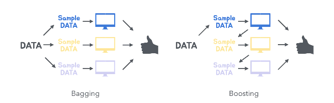
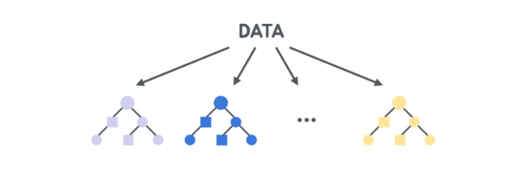

# 앙상블 학습 모델 정리

## 📌 앙상블 학습 한눈에 보기

| 모델 | 용도 및 목적 | 주요 특징 |
|------|------------|-----------|
| 배깅 (Bagging) | 다수 모델을 결합하여 성능 향상 및 과적합 방지 | 병렬 학습, 무작위 샘플링, 예측을 평균 또는 다수결로 결합 |
| 부스팅 (Boosting) | 약한 모델을 결합하여 강력한 모델 생성 및 성능 향상 | 순차적 학습, 이전 모델의 오차를 학습하여 개선 |
| 랜덤 포레스트 (Random Forest) | 결정 트리 기반으로 무작위성과 배깅 기법을 활용하여 과적합 방지 및 예측 성능 향상 | 결정 트리 여러 개를 병렬로 학습하여 결과 결합 |
| 그래디언트 부스팅 머신 (GBM) | 부스팅 기반으로 잔여 오차를 단계적으로 감소시켜 예측 성능 극대화 | 순차적 학습, 잔여 오차를 지속적으로 개선 |
| XGBoost | GBM 기반으로 최적화된 고성능 부스팅 모델 | 병렬 처리, 조기 종료, 정규화, 높은 예측 성능 |

---

## 📌 각 앙상블 모델 상세 설명

### ✅ 앙상블 학습이란?
앙상블 학습(Ensemble Learning)은 여러 개의 모델을 결합하여 단일 모델보다 더 뛰어난 성능을 얻는 기법입니다. 서로 다른 모델들이 다양한 예측을 수행하며, 그 결과를 결합하여 정확성과 안정성을 높입니다.

### ✅ 배깅(Bagging)
배깅은 여러 모델을 독립적으로 학습시키고, 그 결과를 평균 또는 다수결로 결합하여 최종 예측을 수행하는 방법입니다. 데이터를 무작위로 선택(부트스트랩 샘플링)하여 각 모델을 학습시키며, 모델 간 상관성을 낮추어 예측 성능을 높이고 과적합을 방지합니다.

#### 주요 특징
- **무작위 샘플링**: 원본 데이터에서 중복 허용한 랜덤 샘플을 생성하여 각 모델을 학습합니다.
- **병렬 학습**: 각 모델은 독립적으로 동시에 학습될 수 있어 속도가 빠릅니다.
- **안정성 및 일반화 성능 향상**: 개별 모델의 약점을 보완하여 예측 안정성을 높입니다.

### ✅ 부스팅(Boosting)
부스팅은 여러 개의 약한 학습기(weak learner)를 순차적으로 학습시키고, 이전 모델이 잘못 예측한 부분을 다음 모델이 보완하는 방식으로 성능을 지속적으로 향상시키는 방법입니다.

#### 주요 특징
- **순차적 학습**: 이전 모델의 오류를 학습하여 다음 모델이 이를 보완합니다.
- **성능 극대화**: 약한 모델을 결합하여 강력한 성능을 가진 모델을 만듭니다.
- **과적합 관리**: 학습 과정을 조정하여 과적합을 방지합니다.

### ✅ 랜덤 포레스트(Random Forest)

랜덤 포레스트(배깅)는 결정 트리 여러 개를 이용하여 각 트리가 무작위 샘플링된 데이터와 특성을 사용해 독립적으로 학습하고, 이 결과를 평균하거나 다수결로 결합하여 최종 예측을 수행합니다.

#### 주요 특징
- **부트스트랩 샘플링**: 원본 데이터셋에서 랜덤 샘플을 선택하여 트리를 학습합니다.
- **특성의 무작위 선택**: 각 트리는 노드를 분할할 때 무작위로 선택된 일부 특성만을 사용하여 모델 다양성을 확보합니다.
- **높은 정확도와 안정성**: 각 트리의 결과를 결합하여 단일 모델보다 우수한 성능을 얻습니다.

### ✅ 그래디언트 부스팅 머신(GBM)
- GBM은 이전 모델의 잔여 오차(실제 값과 예측 값의 차이)를 단계적으로 줄이는 방식으로 모델을 학습시킵니다. 각 단계에서 새로운 트리는 이전 모델의 잔여 오차를 학습하여 예측 정확도를 점진적으로 향상시킵니다.
- 여러 개의 약한 학습기(weak learner)를 순차적으로 학습시키고, 그 예측 결과를 결합하여 강한 학습기(strong learner)를 만드는 앙상블 기법

#### 주요 특징
- **순차적 학습 방식**: 이전 모델의 잔여 오차를 학습해 지속적으로 예측 성능을 개선합니다.
- **정밀한 조정 가능**: 다양한 매개변수를 통해 성능을 세밀하게 조정할 수 있습니다.
- **강력한 예측 성능**: 분류 및 회귀 문제에서 높은 정확도를 보입니다.

### ✅ XGBoost
XGBoost는 GBM을 기반으로 성능과 효율성을 극대화한 모델로, 병렬 처리, 정규화 및 조기 종료 기법을 활용하여 과적합을 방지하면서 높은 예측 성능을 제공합니다.

#### 주요 특징
- **병렬 처리**: 학습 속도를 높이기 위해 병렬 계산을 지원합니다.
- **조기 종료 기능**: 성능이 향상되지 않으면 학습을 자동으로 멈추어 과적합을 방지합니다.
- **정규화 지원**: L1과 L2 정규화를 사용하여 모델 복잡도를 효과적으로 조절할 수 있습니다.
- **우수한 성능**: 머신러닝 경진대회에서 뛰어난 성능을 입증한 모델입니다.