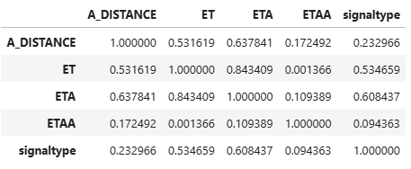

# 데이터 분석

## 기본전제
[기본 데이터]
- 학습데이터 : onenavi_train.csv(7월 20일에서 24일 사이의 수도권 3~15km 주행데이터)
- 평가데이터 : onenavi_evaluation.csv(7월 27일에서 31일 사이의 수도권 3~15km 주행데이터)

[추가 데이터]
- 주소(시군구)데이터 : onenavi_pnu.csv(주행데이터를 기준으로 출발지의 주소 정보, key : RID)
- 신호등(갯수)데이터 : onenavi_signal.csv(주행데이터를 기준으로 경로의 신호등 갯수, key : RID)
- 날씨데이터 : onenavi_weather.csv(주행데이터를 기준으로 해당 일자의 수도권 날씨 정보, key : RID)

## 분석
### CountChart(가로 막대 그래프)
```python
# 통계적 시각화 라이브러리
import seaborn as sns

ax = sns.countplot(
    x=df_total['level1_pnu'],  # x축에 표시할 범주형 변수(시군구)
    palette="RdBu"             # 막대 색상 팔레트: Red ↔ Blue 그라데이션
)
```


### DistChart(분포차트)
```python
import seaborn as sns
# Seaborn의 그래프를 화면에 렌더링하거나 추가 설정
import matplotlib.pyplot as plt

sns.displot(x, kind='hist') # 히스토그램형식
plt.show()
```


### Boxplot(데이터의 ‘보통값(중앙값)’, ‘중간 절반 범위(사분위수)’, 그리고 ‘특이치’를 한눈에 보여주는 그림)
```python
import seaborn as sns
import matplotlib.pyplot as plt

# 시군구별 이동거리
sns.boxplot(
    x = df_total['level1_pnu'],  # x축: 범주형 변수(시군구 단위)
    y = df_total['A_DISTANCE'],  # y축: 수치형 변수(이동 거리)
    data = df_total,             # 사용할 DataFrame
    palette = "RdBu"             # 박스 색상 팔레트: Red↔Blue 계열
)
plt.show()
```


```python
import seaborn as sns
import matplotlib.pyplot as plt

# 시군구별 예상 소요시간
sns.boxplot(x = df_total['level1_pnu'], y = df_total['ET'], data = df_total, palette = "RdBu")
plt.show()
```


### Pariplot : 데이터 프레임의 수치형 변수를 기준으로 밀도와 분포를 한 눈에 확인할 수 있는 차트
```python
import seaborn as sns
import matplotlib.pyplot as plt

sns.pairplot(df_total)
plt.show()
```


### 상관계수 구하기
```python
df_total.corr()
```


```python
# Seaborn의 Heatmap을 활용한 시각화
import seaborn as sns
import matplotlib.pyplot as plt

# 1) df_total의 수치형 컬럼들 간 상관계수 계산
corr_mat = df_total.corr()

# 2) 히트맵 그리기
sns.heatmap(
    corr_mat,
    annot=True,    # 셀마다 상관계수 값을 숫자로 표시
    cmap="RdBu"    # 색상 맵: 붉은색(Red)–푸른색(Blue) 계열
)

# 3) 화면에 표시
plt.show()
```
