# 데이터 전처리

## 라이브러리 Import
```python
import pandas as pd # 테이블 형태(데이터프레임)로 데이터를 다루는 데 최적화된 라이브러리
import numpy as np # 수치 계산, 배열 연산을 빠르게 해 주는 라이브러리
```
## 데이터 불러오기 및 합치기
- concat: 두 데이터프레임을 위아래로 “쌓기”
- merge(on="RID"): 공통 열(RID)을 기준으로 좌우 데이터를 “붙이기”
```python
# 통계적 시각화 라이브러리
# — 학습/평가 데이터 로딩
df = pd.read_csv("onenavi_train.csv", sep="|")            # 훈련용 데이터
df_eval = pd.read_csv("onenavi_evaluation.csv", sep="|")  # 평가용 데이터

# — 전처리 기준 통일을 위해 두 데이터를 합칩니다.
df_total = pd.concat([df, df_eval], ignore_index=True)

# — 추가 정보 로딩
df_pnu    = pd.read_csv("onenavi_pnu.csv",    sep="|")  # 주소 정보
df_signal = pd.read_csv("onenavi_signal.csv", sep="|")  # 신호등 개수 정보

# — RID(레코드 ID)를 기준으로 합치기
df_total = pd.merge(df_total, df_pnu,    on="RID")
df_total = pd.merge(df_total, df_signal, on="RID")

#✔️ df_total.shape, df_total.columns, df_total.head() 등을 통해
#   제대로 합쳐졌는지 확인해 보세요.
```
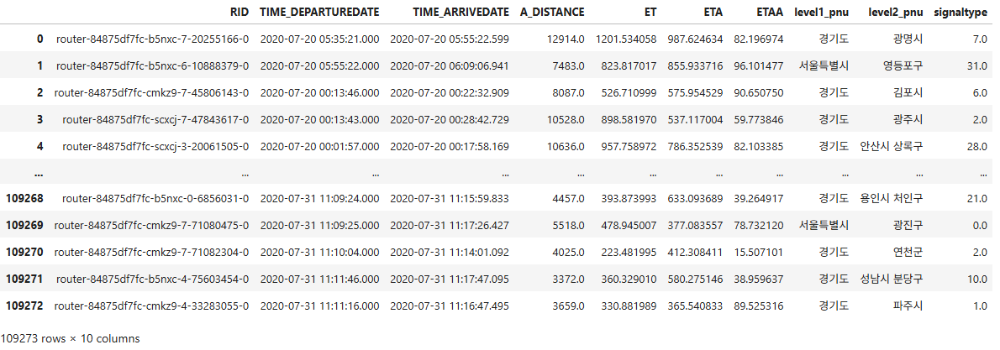

## 결측치(Null) 처리
### 결측치 확인
```python
df_total.isnull().sum()
```
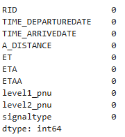

### 결측치 제거(dropna) 또는 대체(fillna)
- 완전히 비어 있는 행 제거(dropna)
```python
df_total = df_total.dropna()
```

- 특정 컬럼만 대체(fillna)
```python
# fillna(number) : number로 채우기 
df_total = df_total.fillna(0)
# 바로 앞의 값으로 채우기
df_total = df_total.fillna(method='pad')
```

## 이상치(Outlier) 처리
### 분포 확인
```python
import seaborn as sns # matplotlib 기반의 통계 시각화 라이브러리
import matplotlib.pyplot as plt # 파이썬 시각화의 기본 라이브러리

# 모든 수치형 열(column)대상 변수 간의 상관관계, 분포 모양, 이상치(outlier) 유무 표기
sns.pairplot(df_total)
plt.show()
```
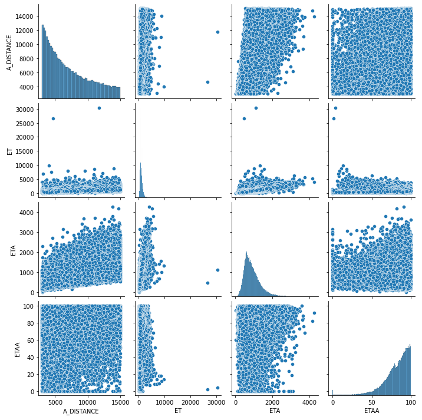

### 이상치 확인
- ET에서 15000 이상인 이상치 2개가 있음
```python
df_total[df_total['ET']>15000] # 2개
```

### 이상치 제거
```python
# Outlier 제거 후 데이터만 남기기
df_total=df_total[df_total['ET']<=15000]
df_total
```

### 새로운 변수 확인
```python
# 평균시속 변수 만들기 : 속도는 거리 나누기 시간
df_total['PerHour']=(df_total['A_DISTANCE']/1000)/(df_total['ET']/3600)

# 데이터 분포 확인하기
df_total.describe()
```
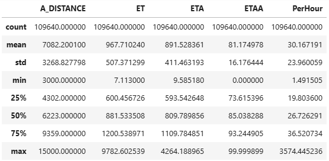

```python
# 시속 130이상 데이터 수 확인하기 : 몇 개 되지 않으면 제거하자!
len(df_total[df_total['PerHour']>130])

# Outlier 제거 후 데이터만 남기기
df_total=df_total[df_total['PerHour']<=130]
df_total
```

### 데이터 정제
```python
df_total['level1_pnu'].unique()
# array(['경기도', '서울특별시', '인천광역시', '-', '충청북도', '강원도', '충청남도'], dtype=object)

# 서울/경기/인천으로 데이터 정제
# # 1) Boolean 인덱싱(filtering)을 사용해
#    level1_pnu 컬럼이 '서울특별시' 또는 '경기도' 또는 '인천광역시'인 행만 남깁니다.
df_total=df_total[(df_total['level1_pnu']=='서울특별시')|(df_total['level1_pnu']=='경기도')|(df_total['level1_pnu']=='인천광역시')]

# 2) 인덱스를 0부터 순차적으로 다시 부여하고, 기존 인덱스 컬럼은 제거(drop)합니다.
df_total=df_total.reset_index(drop=True)
df_total
```
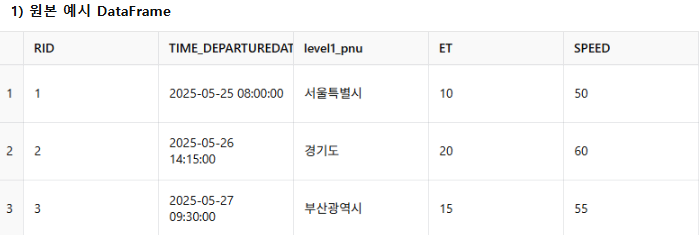
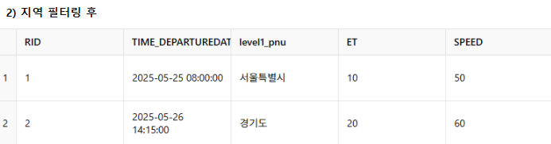

## 더미변수 생성
### 진행 상황 표시용 라이브러리 설치 및 임포트
```python
!pip install tqdm

import datetime
from dateutil.parser import parse # 문자열로 된 날짜·시간을 datetime 객체로 바꿔 주는 함수
from tqdm import tqdm # 반복문 진행 상황(progress bar)을 시각적으로 보여주는 라이브러리
```
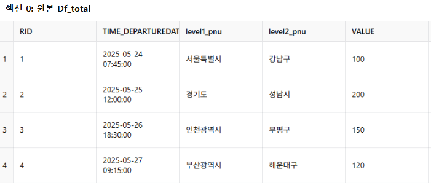

### 날짜·시간 정보 추출
- parse(w)로 문자열을 datetime으로 변환
- .weekday(), .hour, .day로 요일·시간·일 정보를 추출
- tqdm으로 진행바를 표시하며 반복
```python
weekday_list = []
hour_list    = []
day_list     = []

for w in tqdm(df_total['TIME_DEPARTUREDATE']): # 데이터 개수만큼 진행바를 보여주며 반복
    parse_data_w = parse(w)                  # 문자열 → datetime
    weekday_list.append(parse_data_w.weekday())  # 0=월 … 6=일
    hour_list   .append(parse_data_w.hour)       # 0~23시
    day_list    .append(parse_data_w.day)        # 1~31일

df_total['WEEKDAY'] = weekday_list
df_total['HOUR']    = hour_list
df_total['DAY']     = day_list
```
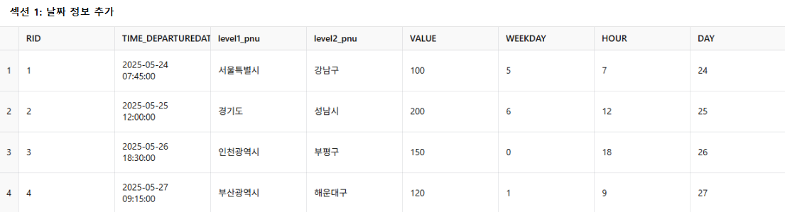

### 평가용 데이터 분리 및 저장
- DAY >= 27인 행만 new_df_eval에 추출하여,
- 파이프(|) 구분자로 CSV 파일로 저장합니다.
```python
new_df_eval = df_total[df_total['DAY'] >= 27] # DAY >= 27 데이터 분리
new_df_eval.to_csv("onenavi_evaluation_new.csv", sep="|", index=False) # csv로 저장
```
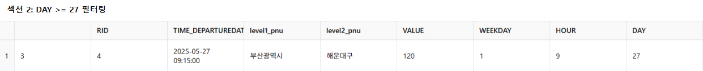

### 더미변수 생성
- dummy_fields에 있는 각 범주형 컬럼(WEEKDAY,HOUR,level1_pnu,level2_pnu)에 대해
- pd.get_dummies로 카테고리별 0/1 컬럼을 생성
- 원본 컬럼을 제거해 순수한 숫자형 피처만 남깁니다.
```python
dummy_fields = ['WEEKDAY','HOUR','level1_pnu','level2_pnu']

for dummy in dummy_fields:
    # 1) pd.get_dummies: 단일 컬럼을 더미 변수 DataFrame으로 변환
    # 예를 들어 WEEKDAY 안에 값이 0,1,2 세 가지가 있다면,
    # WEEKDAY_0, WEEKDAY_1, WEEKDAY_2라는 새로운 DataFrame을 만들고,
    # 각 행이 해당 카테고리일 때 1, 아니면 0을 채워 넣습니다.
    dummies = pd.get_dummies(
        df_total[dummy], # 변환할 원본 시리즈(컬럼)
        prefix=dummy,    # 생성될 컬럼 이름 앞에 붙일 접두사
        drop_first=False # False면 모든 카테고리에 대해 컬럼을 생성
    )
    # df_total과 dummies를 합침
    df_total = pd.concat([df_total, dummies], axis=1)

# 더 이상 필요 없는 dummy_fields 컬럼(예: WEEKDAY, HOUR 등)을 제거
df_total = df_total.drop(dummy_fields, axis=1) # axis=1 : 열삭제
```
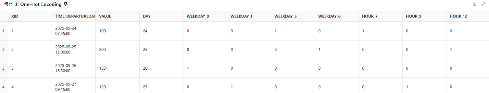
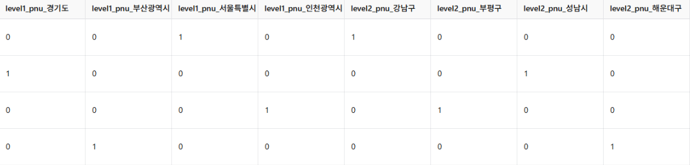

## 데이터 스케일링(ET가 Target)
- 날짜 정보 분리: 스케일링 전 기준일(DAY)을 떼어 둠
- 불필요 컬럼 제거: ID, 시간, 타깃, 날짜 등을 제외
- 수치형 피처 스케일링: MinMaxScaler로 모두 0~1 로 정규화
- 날짜 다시 결합: Train/Eval 기준용으로 DAY를 다시 붙임
- Train/Eval 분리: day 기준으로 피처셋 분할, DAY 제거
- 타깃 추출: Train 기간(DAY≤24) 의 ET를 train_target 으로 저장

### DAY 컬럼(1~31 일)을 따로 떼어서 data_day 에 저장
```python
# 기준일자 저장 : why? 날짜가 스케일링이 되면 안됩니다.
data_day=df_total['DAY']

# 학습에 필요 없는 컬럼 제거
train_data=df_total.drop(['RID','TIME_DEPARTUREDATE','TIME_ARRIVEDATE','ET','ETAA','PerHour','DAY'],axis=1)
columnNames=train_data.columns # A_DISTANCE', 'ETA', 'signaltype', 'WEEKDAY_0', 'WEEKDAY_1...
train_data
```
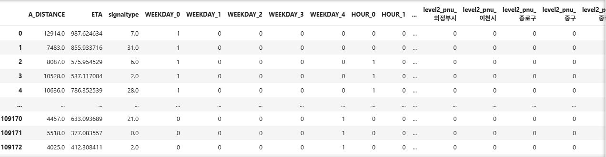

### train_data에 들어 있는 수치형 피처들을 0~1 범위로 정규화(Scaling)
```python
# 스케일링
# 각 피처(feature)를 최소값을 0, 최대값을 1로 선형 변환해주는 라이브러리
from sklearn.preprocessing import MinMaxScaler

scaler = MinMaxScaler(feature_range=(0, 1)) # 변환된 값의 최소·최대 범위를 0~1로 지정

# fit(...): train_data의 각 컬럼별 최소·최대값을 계산(학습)
# transform(...): 계산된 최소·최대값을 이용해 train_data의 값을 0~1 사이로 변환
feature = pd.DataFrame(scaler.fit_transform(train_data))

# 컬럼 이름 리스트(columnNames)를 새로 만든 feature DataFrame에 그대로 지정
feature.columns=columnNames
feature
```
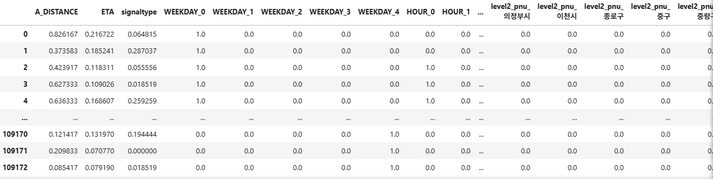

### 다시 날짜를 합칠게요 : Train/Evaluation 분리를 위해
```python
feature['DAY'] = data_day
# 이제 0~1 로 스케일된 피처 + 원본 날짜(정수) 두 가지가 공존하게 되었습니다.
```
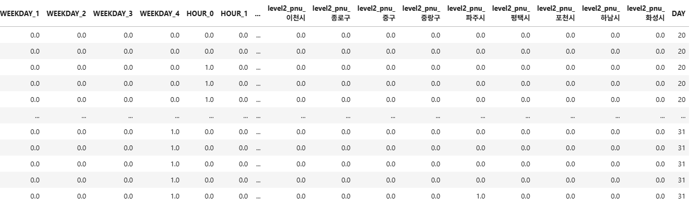

### traindata 지정 (1~24일)
```python
train_feature = feature[feature['DAY'] <= 24]
# DAY컬럼은 제거
train_feature = train_feature.drop(['DAY'], axis=1)
```

### evaldata 지정 (27일 이후)
```python
eval_feature = feature[feature['DAY'] >= 27]
eval_feature = eval_feature.drop(['DAY'], axis=1)
```

### target 저장
```python
# Train 기준(≤24일) 에 해당하는 행의 ET값을 저장
train_target = df_total[df_total['DAY'] <= 24]['ET']
```

