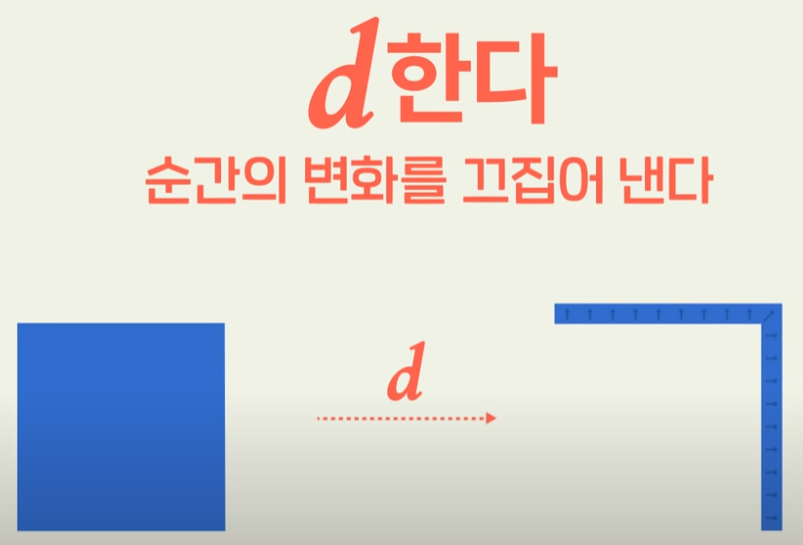
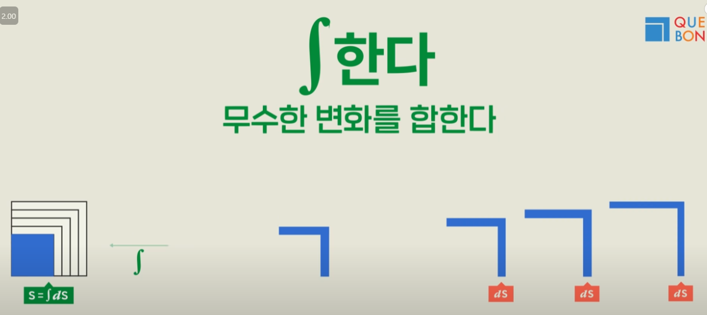
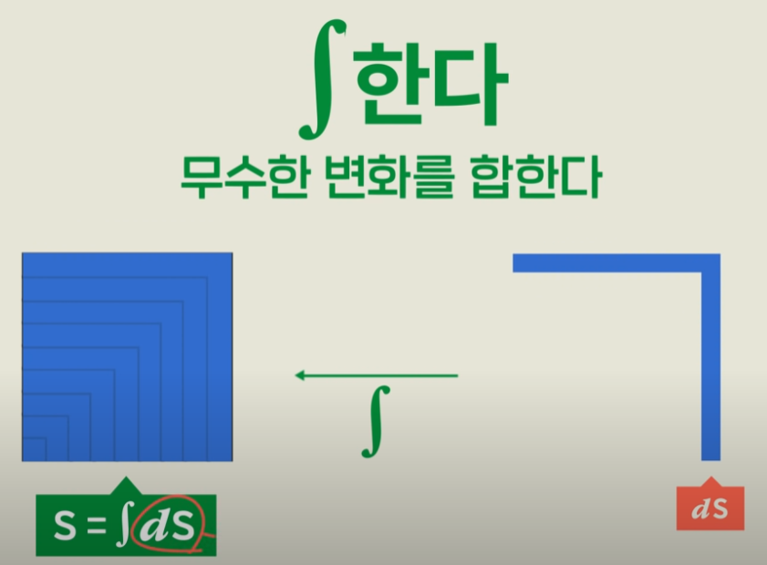

## 미분

## 적분

# [머신러닝 기초 수학 개념 정리](https://academia.spartacodingclub.kr/classroom)

## 1. 데이터 표현 형태

### 1.1 스칼라와 벡터

#### 스칼라(Scalar)
- 단일 숫자 값을 의미합니다.
- 예시: 수학 시험 점수(하나의 숫자)

### 벡터(Vector)
- 여러 숫자를 한데 묶은 리스트 형태입니다.
- 예시: 국어, 수학, 영어 등 여러 과목의 시험 점수
- 벡터 표기 예: \( x \in \mathbb{R}^6 \)

#### 벡터 연산
- **원소별 연산**: 같은 위치의 원소끼리 더하거나 빼기
- **내적 (Dot Product)**: 같은 위치 원소를 곱한 뒤 더한 값

### 1.2 행렬 (Matrix)
- 여러 벡터를 쌓은 형태입니다.
- 예시: 이미지 데이터(32×32 픽셀)의 숫자 배열

#### 행렬 곱셈
- 앞 행렬의 열 수와 뒤 행렬의 행 수가 같아야 연산 가능
- 계산은 각 행과 열의 내적으로 수행됩니다.

---

## 2. 함수(Function)

- 데이터 사이의 관계 또는 규칙입니다.

### 함수의 구성 요소
- **정의역(Domain)**: 입력값의 집합
- **공역(Codomain)**: 출력값의 후보 집합
- **실제 출력 값들의 집합**: 공역 중 실제 출력된 값

### 함수의 성질
- **일대일(Injective)**: 서로 다른 입력은 서로 다른 출력으로 연결
- **일대일 대응(Bijective)**: 일대일 함수이며 모든 공역이 출력으로 나타남 (역함수 존재)

---

## 3. 미분(Differentiation)

### 미분 개념
- 함수의 작은 변화에 따른 출력 값의 변화를 나타냅니다.
- 접선의 기울기(함수가 변화하는 속도)를 나타냅니다.

#### 미분 정의
\[\frac{df(x)}{dx}\Big|_{x=a} = \lim_{\epsilon \to 0} \frac{f(a+\epsilon)-f(a)}{\epsilon}\]

### 미분이 정의되지 않는 경우
- 뾰족하거나 끊어진 점에서는 미분값이 존재하지 않습니다.

### 편미분과 그라디언트
- **편미분**: 다변수 함수에서 한 변수만 변화시켜 함수의 변화를 측정
- **그라디언트(Gradient)**: 모든 편미분을 모아놓은 벡터

#### 예시
\[f(x,y) = x - y \quad \Rightarrow \quad \nabla f = (1, -1)\]

### Jacobian(야코비안)
- 입력과 출력 모두 벡터일 때, 편미분 값들을 모은 행렬입니다.

---

## 핵심 요점 정리

### 데이터 표현
- **스칼라**: 하나의 숫자 값
- **벡터**: 여러 숫자가 모인 리스트
- **행렬**: 여러 벡터가 모인 형태

### 함수
- 입력(정의역)에서 출력(공역)을 연결하는 규칙

### 미분
- 함수의 순간적인 변화율을 나타내며, 함수의 최적화 과정에서 중요한 개념입니다.
- 편미분, Gradient, Jacobian 등을 활용하여 다차원 데이터를 분석합니다.

---

### 핵심 요약 (수학 없이 간단히 이해하기)
- **데이터는 숫자 리스트(벡터 또는 행렬)로 표현합니다.**
- **함수는 데이터 간의 관계를 나타냅니다.**
- **미분은 데이터 관계가 변화하는 속도를 측정합니다.**

이러한 개념들은 머신러닝과 딥러닝의 기초가 되는 중요한 수학적 기반입니다.